# 花月 Flower Moon - 唐詩宋詞學習遊戲平台

 

## 專案簡介
**花月 (Flower Moon)** 是一個致力於推廣**唐詩宋詞**的互動式網頁平台。我們的核心目標是讓詩詞愛好者在輕鬆愉快的遊戲氛圍中學習經典文學，深入感受中國傳統文學的韻律與意境之美。

透過整合日曆、卡片記憶與多樣化的趣味遊戲，我們將深奧的古典文學轉化為觸手可及的互動體驗，讓讀詩、背詩、品詩不再是枯燥的任務，而是一場跨越時空的文化探險。

---

## 主要頁面與功能介紹

### 📅 詩詞日曆 (Main Page)
這是平台的門面，結合了中國傳統曆法與詩詞：
- **每日一詩**：每天推薦一首精選唐詩或宋詞，陪你度過春夏秋冬。
- **農曆與宜忌**：整合農曆資訊與民俗「宜忌」，展現深厚的傳統文化底蘊。
- **節日提醒**：自動標記重要節慶，並提供與時令相符的文學內容。
 

### 🎴 詩詞默背卡片 (Cards)
專為「默背」設計的學習工具：
- 提供直觀的卡片介面，幫助使用者背誦經典名句。
- 支持翻轉與切換，是複習與鞏固記憶的好幫手。
 

### 🎮 趣味遊戲模組
我們設計了多款各具特色的遊戲，考驗你的詩詞功力：
1. **慢思快選 (Game 1)**：在壓力與時間的挑戰下，精確選擇正確的詩句。
 

2. **飛花令 (Game 2)**：經典的傳統遊戲與現代交互結合，測試你對特定關鍵字詩句的掌握度。
 

3. **字爬梯 (Game 3)**：文字與邏輯的考驗，透過拼寫與重組，還原絕美的詩詞篇章。
 

4. **眾裡尋他千百度 (Game 4)**：在混亂的字群中，憑直覺與實力「尋找」那句動人心弦的詩。
 

5. **詩詞小精靈 (Game 5)**：在迷宮中尋找散落的文字，躲避四隻小精靈的追趕，拚湊出記憶中的美好詩句。
 

6. **詩陣侵略 (Game 6)**：擊落入侵的外太空敵人，收復被掠奪的詩句，保護詩詞陣營。
 

7. **青鳥雲梯 (Game 7)**：幫助青鳥降落在詩詞方塊上，勇敢地往前飛向浩瀚詩詞白雲。
 

8. **一筆裁詩 (Game 8)**：一筆畫出一句詩，詩詩相連得高分。
 

9. **詩韻鎖扣 (Game 9)**：將混亂擺放的詩句螺帽，依照詩句的順序排列擺回螺絲栓，讓詩句重新合而為一。
 

10. **擊石鳴詩 (Game 10)**：敲磚塊，擊落入侵的外太空敵人，解開被隱藏的詩句。
 

11. **翻墨識蹤 (Game 11)**：考驗記憶力，翻開被覆蓋的詩句，找出正確擺放位置，一字一字拼湊出完整詩句。
 

12. **疏影橫斜 (Game 12)**：同時考驗詩詞能力與記憶力，除了熟記詩句，還需依序翻開被覆蓋的詩句，高溫融化感性與理性，一起燃燒大腦。
 

13. **人事時地 (Game 13)**：從詩詞的人、事、時、地四個維度出發，在限時內精確回答詩詞相關問答，考驗對詩詞背景知識的全面掌握。
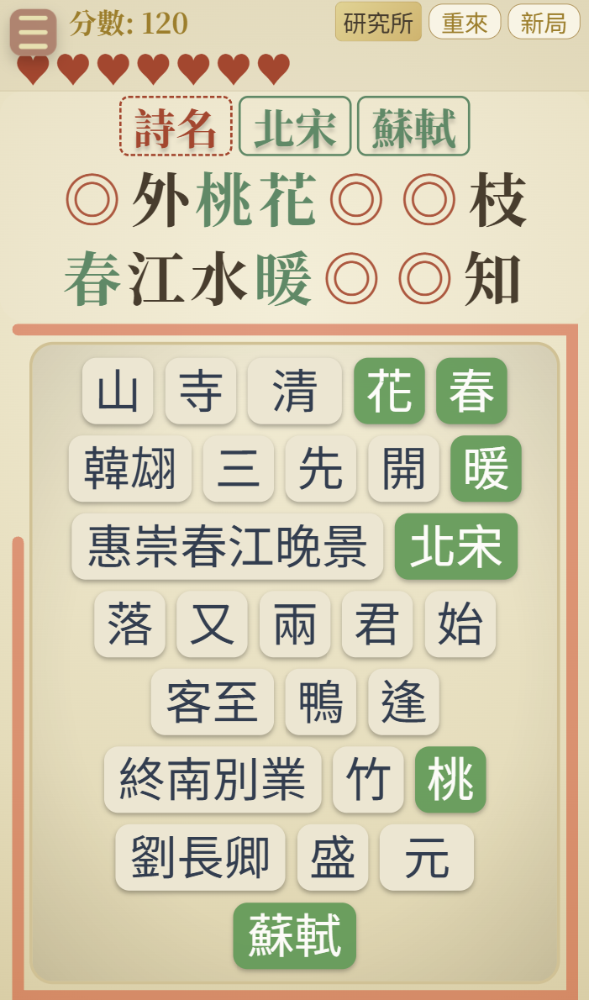 

14. **步步驚心 (Game 14)**：步步為營的詩詞填空挑戰，在層層遞進的關卡中逐字填寫詩句，每一步都可能是通往正確答案或萬丈深淵的轉折。
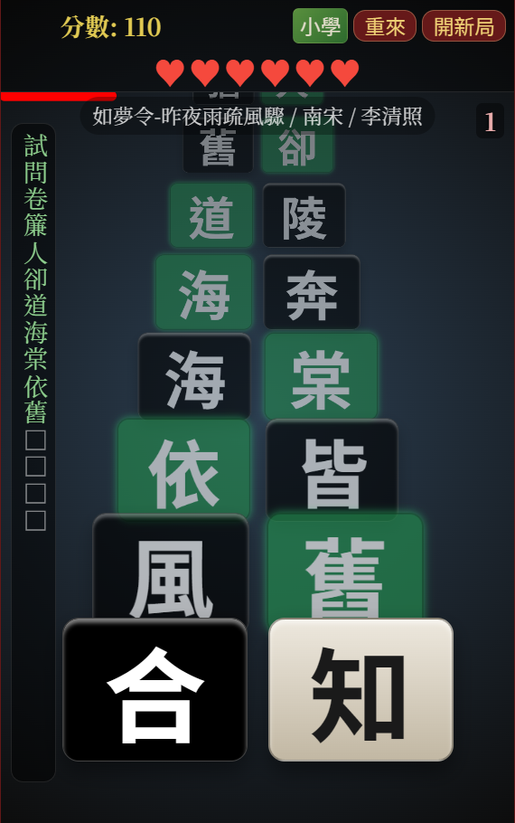 

15. **墨韻游龍 (Game 15)**：化身筆頭游龍，在 13×18 的墨色棋盤上依字序收集散落的詩句字塊，讓龍身化為流動的彩虹詩篇，一字一字把整首詩吃進靈魂。
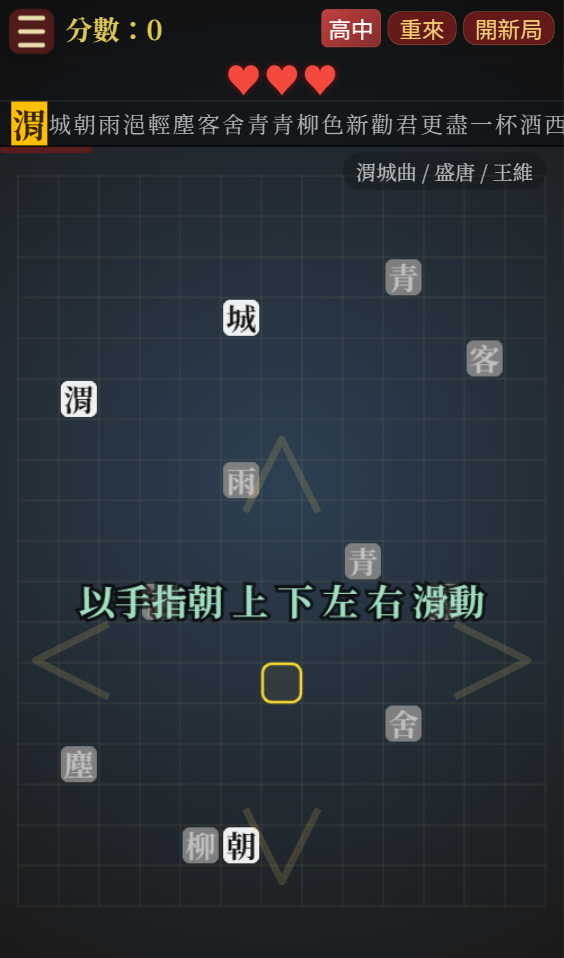 

16. **打地詩 (Game 16)**：經典「打地洞」的詩詞版。從多個地洞中隨機彈出正確字與大量混淆字，玩家須在正確時機依詩句字序精準擊打，同時避開語意誘餌字。
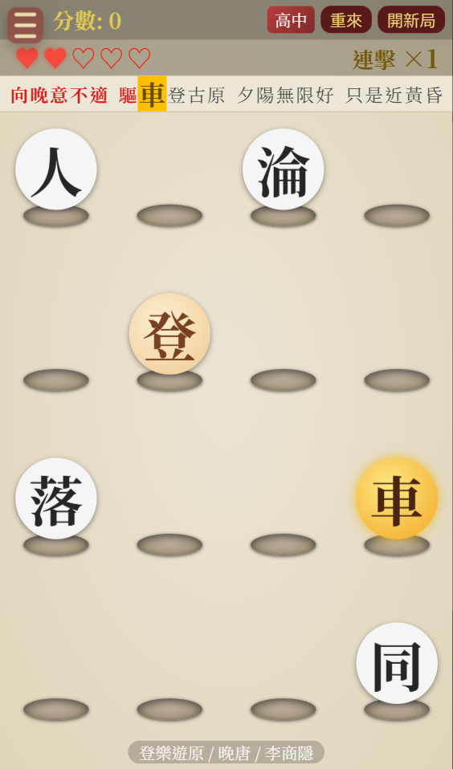 

17. **青蛙過河 (Game 17)**：操控象徵「詩心」的青蛙，依詩句正確字序在流動的荷葉與木頭間跳躍集字；荷葉踩過後緩緩沉沒，逼迫玩家在動態河面上即時判斷下一步落腳。
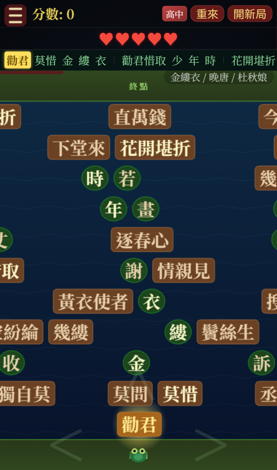 

18. **馬戲團 (Game 18)**：化身騎著書卷的詩人，穿越「跳火環關」與「彈簧床關」兩種馬戲舞台，依字序只跳載著正確詩字的火環、或精準落在標有下一個字的彈簧床上，連續完美落點拼出整首詩。

19. **詩碟狂襲 (Game 19)**：底部砲台左右移動射擊緩緩下降的詩詞字陣。每排只有一個正確字，在混淆字干擾與炸彈轟炸中逐字擊碎正確字、清空全陣。
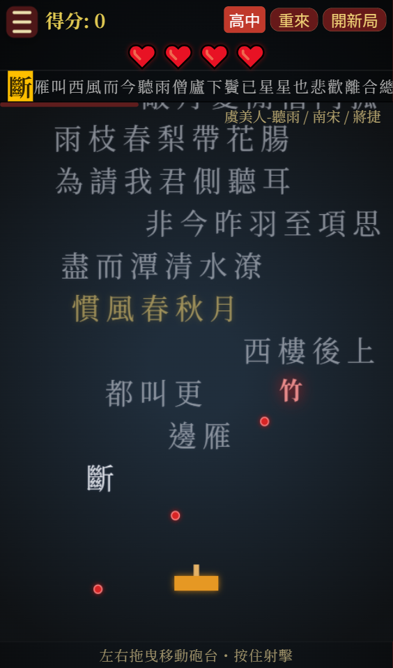 

20. **丟三落一 (Game 20)**：從詩中截取數句、隱藏其中一整句，玩家從 4~8 個完整詩句選項中選出正確的那一句，填回它在詩中消失的位置。
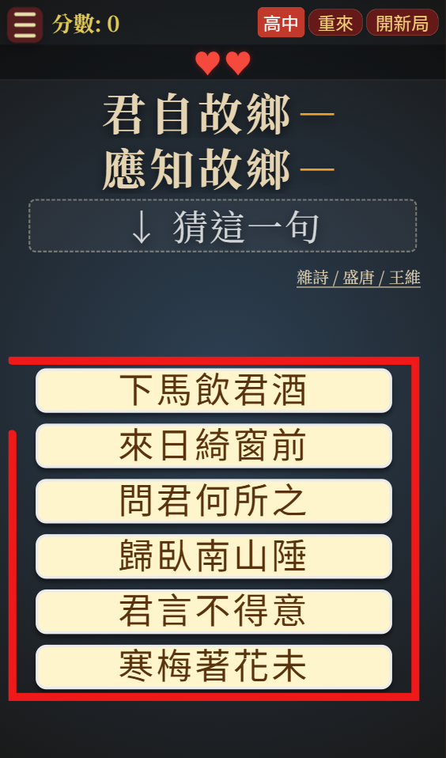 

21. **橫批成詩 (Game 21)**：在 8×13 字元棋盤上以左右拖曳換位、上下拖曳滑動直棒，讓每根直棒中的正確字對齊中央「黃金橫批列」，使橫批由左至右拼出隱藏詩句。
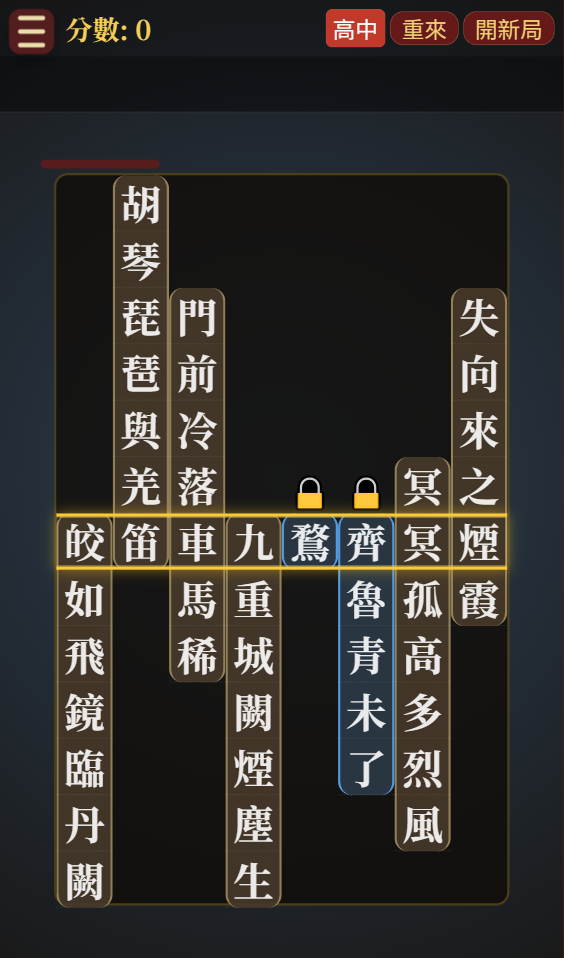 

22. **詩詞拼圖 (Game 22)**：系統把詩的多行文字切割為各種形狀拼圖片（1×1、1×2、1×3、L 型、1×4、2×2）打亂排列，玩家拖曳拼回完整詩詞原文。
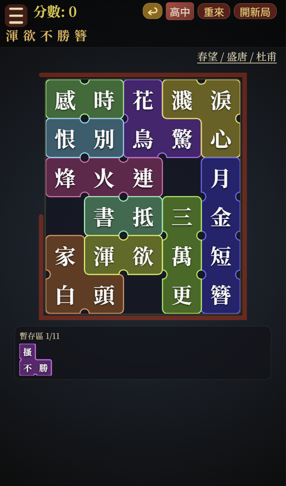 

23. **縱橫集句 (Game 23)**：在 9×9 格子中重組打散的拼圖，還原「一句主軸詩 + 多首副句詩縱橫交叉」的填字畫，每首副句與主句共享一字，形成多維度詩詞交叉記憶網絡。
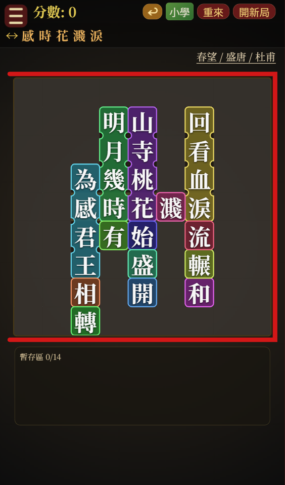 

24. **三字成珠 (Game 24)**：花月版三消連線。在漢字棋盤上拖曳交換相鄰字塊形成同字三連消除，並收集當前句的目標字。完成一句進入下一句，集滿整首詩過關。連消 4/5 連生成方向爆破道具。
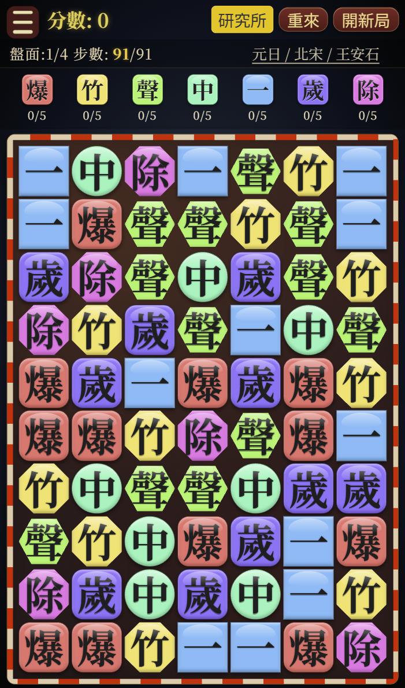 

25. **連珠拾字 (Game 25)**：按住起點字塊後沿八方向拖曳穿過相鄰同字字塊，放開時整條 ≥3 連消除，路徑長度即為該字收集次數。順序符合詩句字序時觸發「順序成詩」倍率加成。
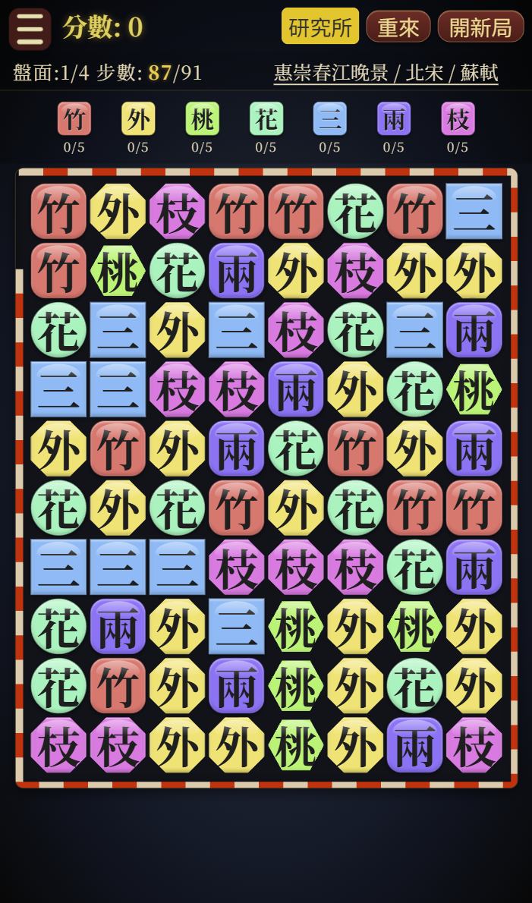 

26. **投珠破句 (Game 26)**：花月版泡泡龍。自下方發射台朝上方字泡泡牆射出字泡泡，命中 3 顆以上同字即消除。泡泡牆每隔數秒下推，須在觸底前完成詩句字頻收集。
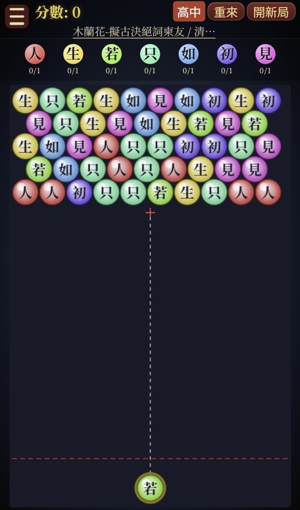 

27. **詩磚壘塔 (Game 27)**：花月版俄羅斯方塊。在 6×12 垂直棋盤中引導下落的「漢字磚塊」（2~4 字組合）落入合適位置，橫向或縱向形成同字 3 連即消除。堆疊觸頂前完成整首詩過關。
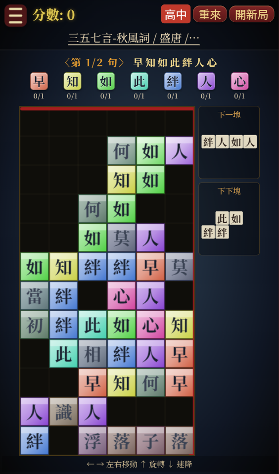 

28. **兩心相印 (Game 28)**：花月版連連看。在靜態漢字盤面點選兩張相同字牌；若兩牌間能以不超過 3 折角的直線路徑相連則消除，連續符合字序觸發倍率加成。
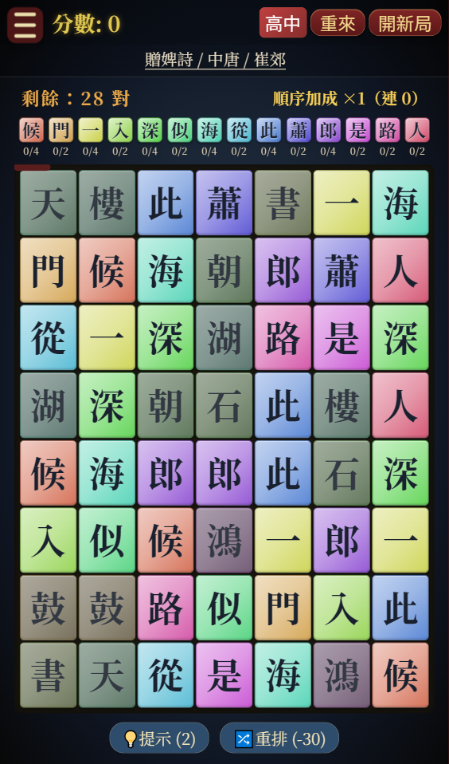 

29. **字龍盤環 (Game 29)**：花月版軌道滾球射擊。在偽 3D 環形軌道中朝持續流動的字球長龍射出字球，命中 3 顆以上同字相連即消除。長龍頭抵達終點前完成整首詩過關。
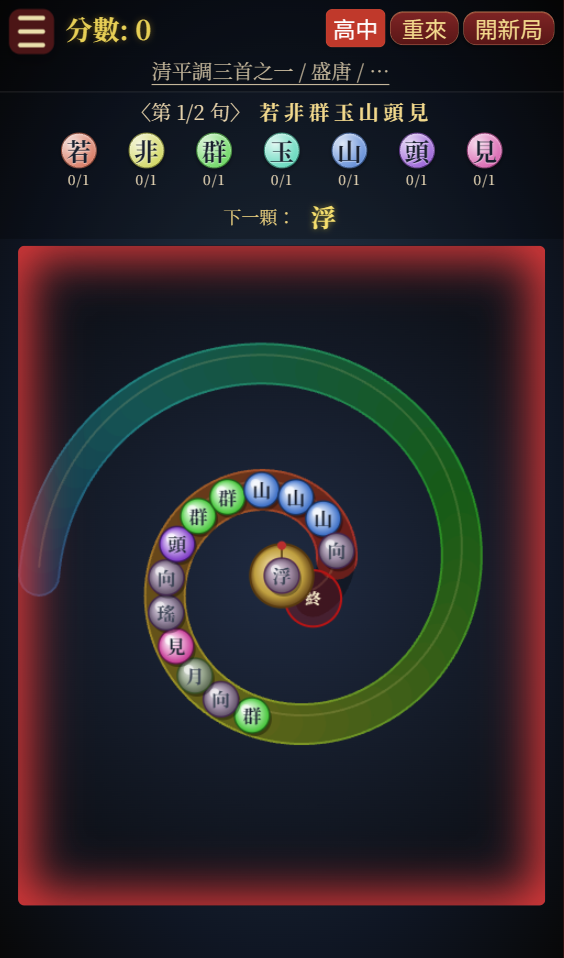 

30. **層巒疊翠 (Game 30)**：花月版立體麻將。點擊偽 3D 立體字牌山「最上層且左右未被遮擋」的字牌，飛入下方暫存槽；槽中集滿 3 張同字即消除。在暫存槽塞滿前完成詩句字頻收集。
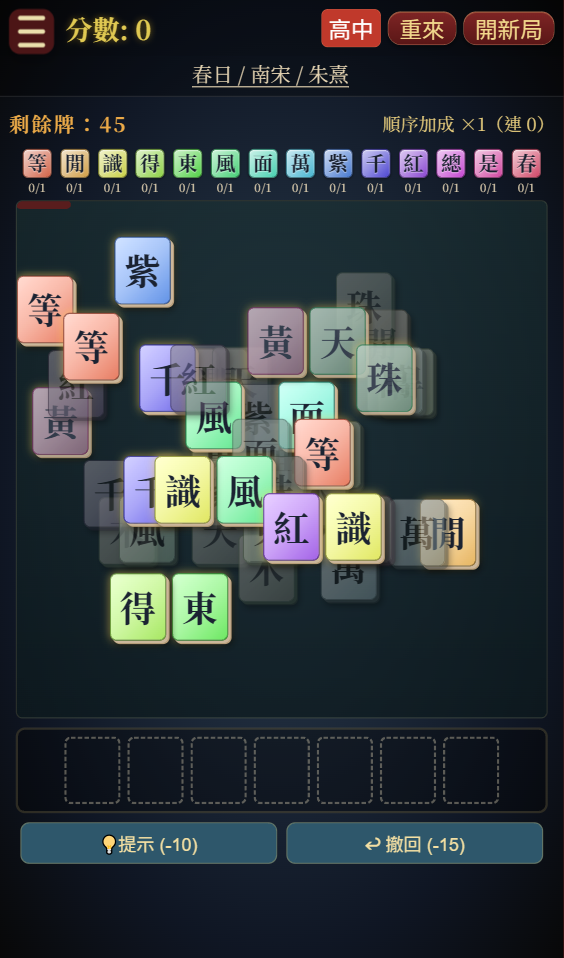 

31. **詩眼覓蹤 (Game 31)**：螢幕中央一句詩裡有一個字被替換成意義或字形相近的「替身字」。玩家在限時內找出可疑字，往下拖曳浮出直排候選字捲輪，放手對齊紅線復原原字。同時考驗詩詞熟識度與字形辨識力。
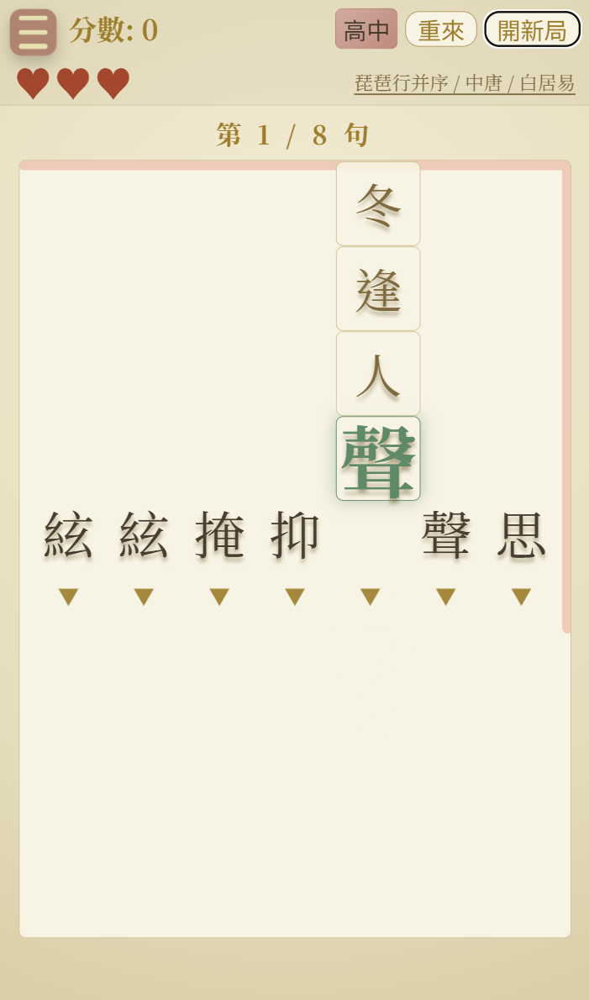 

32. **尋詩地圖 (Game 32)**：化身「詩詞地理學家」，在簡化中國古地圖上探索 20 個著名地點（廬山、長安、揚州、洛陽、岳陽、黃鶴樓、寒山寺等）。每處對應一首相關詩作與地方故事，讀完故事後須在詩文中找出涉及該地的景物關鍵字並標回地圖。
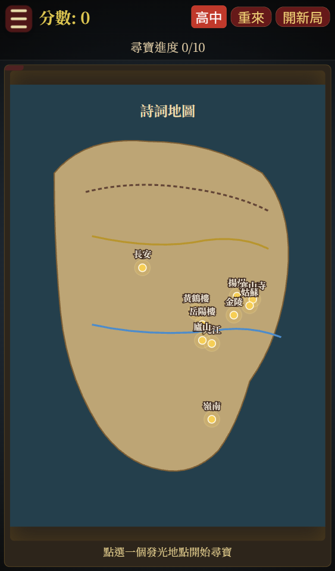 

33. **作者是誰 (Game 33)**：螢幕中央顯示一句（或數句）詩，下方列出 4~8 位候選詩人。玩家在限時內判斷詩出自誰手、點擊正確姓名得分，連續答對觸發連擊倍率，培養「讀詩識人」的快速反應。
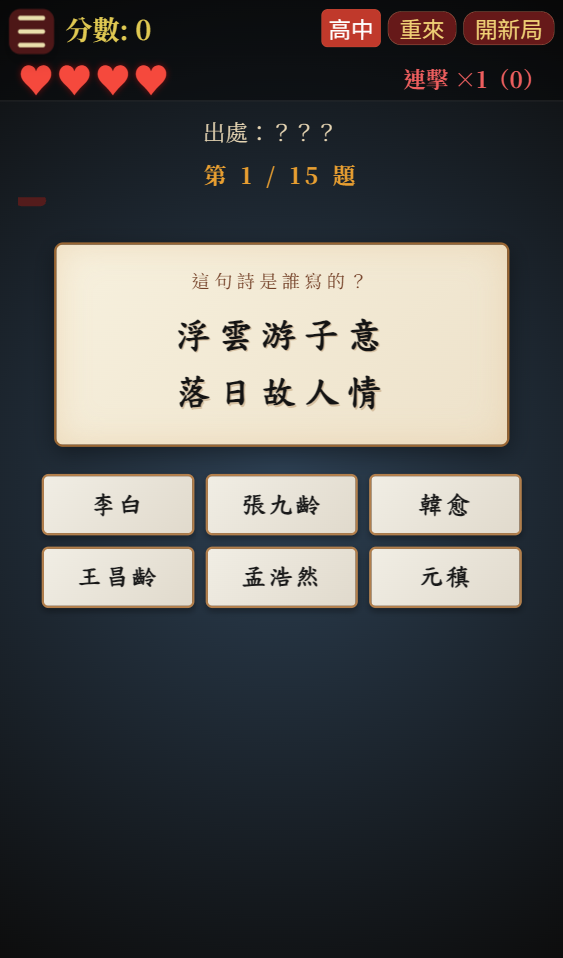 

34. **猜猜詩題 (Game 34)**：螢幕顯示一首完整詩作但標題位置以「？？？」遮蔽，下方縱向列出 4 張候選標題卡。玩家在限時內判斷正確詩題，答對則標題以毛筆動畫寫入〈？？？〉位置，並朗誦整首詩一次。
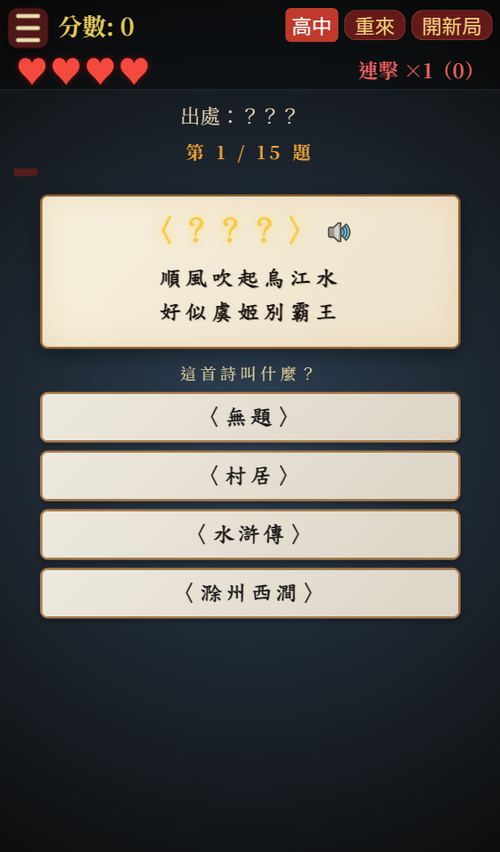 

35. **詩人心情 (Game 35)**：玩家化身詩人的「同行者」，閱讀詩人某日的小故事（如李白被賜金放還、蘇軾夜遊承天寺、杜甫春望長安）。讀完系統提問「此刻他寫下哪首詩？」，從 4 句候選詩中選出最符合該情境心境的一句，答對則播放整首詩的情境動畫並飛入「詩人日記」收藏。
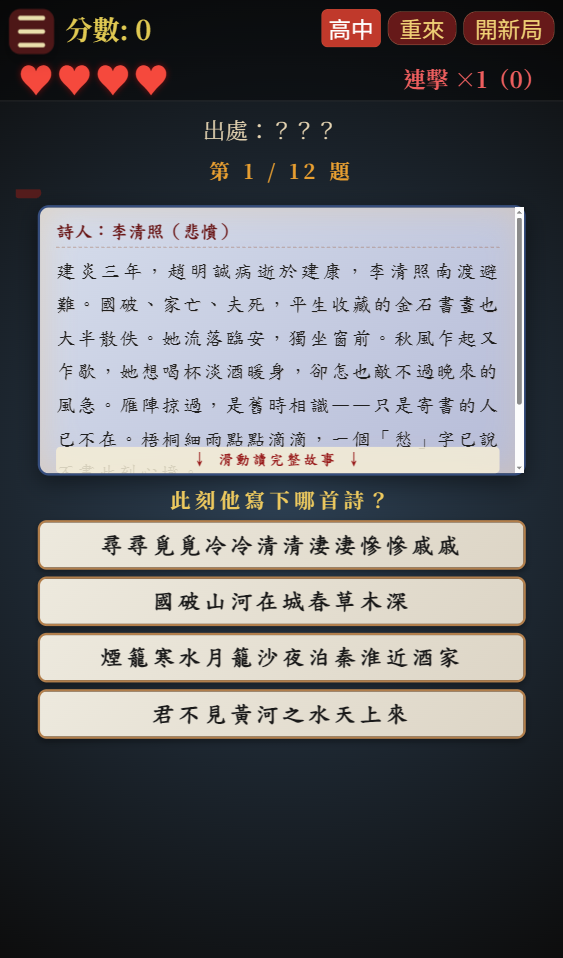 

36. **轉輪覓詩 (Game 36)**：花月版 Wordle。目標詩句固定壓縮於 7 格判定網格（五言題目置中填入、左右留空），玩家上下拖曳詩句轉輪選取候選整句提交，逐格翻牌染色（青瓷綠＝位置對、提示藍＝字在但位置錯、淡墨灰＝字不存在）。頂端常駐「正確答案」摘要行即時顯示已確認的綠字，孤立字（轉輪找不到的字）依難度自動送出作為免費提示；也可點「手動輸入答案」直接鍵入猜測。沒有次數上限、沒有失敗結局，判定網格可無限向下捲動延伸，玩家可持續作答直到集滿全部綠字通關。

37. **步步為陣 (Game 37)**：玩法與「步步驚心」相同（依序點擊置中呈現的答案），差異在於答案按鈕的排版：**每一句**的第 1 字僅 1 個按鈕、第 2 字左右並排 2 個、第 3 字起以 2×2、3×3…最高 6×6（36 宮格）呈現，每個答案宮格皆固定為介面寬度的 80%、字級為按鈕高度的 80%；各難度另有宮格數量上限（小學 9／中學 16／高中 25／大學與研究所 36），超過上限會自動縮減為不超過上限的最大合法宮格，藉此調節低難度的視覺搜尋負擔；選項越多、答對得分倍率越高。答案陣型永遠置中顯示於遊戲區正中央，點擊後先停留約 0.45 秒讓玩家看清楚綠（答對）／紅（答錯）回饋，時間到即整組從畫面移除、換上下一題，不做任何堆疊或漸隱殘留。

### 🌙 隨遇而安（視覺療癒頁）
一頁無計分、無勝負的純觀看舒壓互動頁面，取多首詩詞讓文字自行漂移聚散：
- **多詩混拆湊字數**：為了讓畫面熱鬧、字數夠多，改為「多首詩詞湊字數」——每次向題庫抽一小段固定偶數句（至少 2 句、符合「兩句一聯」原則）的詩句，逐段累加不同首詩詞，直到全部字數落在目標範圍，絕不會只抽到單一句或奇數句。
- **拆字散落**：把抽到的所有句子逐字拆開，隨機灑落於深色畫面中，點擊「隨遇而安」按鈕才開始漂移。
- **物理漂移與碰撞**：每個字各自以不同速度、方向緩緩漂移並略為減速；碰到畫面邊緣會反彈並略微加速，同時附加隨機偏轉角度，避免陷入完全水平/垂直、永遠碰不到其他字的死路徑。
- **手指/滑鼠拖曳擾動**：可直接用手指或滑鼠拖曳畫面，半徑範圍內的字會被主動推開——尚未開始漂移時也有即時位移回饋，開始漂移後拖曳還會附帶一點延續動能，讓玩家能主動撥弄字塊互動，不只是被動旁觀。
- **同句相鄰合併成句**：兩字相碰時，若屬同一句的相鄰位置即合併成一組（尺寸隨每次有效合併漸漸放大），繼續以同樣規則漂移碰撞；若不屬同句相鄰位置則彈開並瞬間加速。句子之間永不合併，各自獨立漂移。
- **依完成順序著色**：每句字首次合併（湊滿 2 字以上）即依「第幾句完成連接」的順序著色（紅、橙、黃…依句數平均分布色相），句子完全拼成後仍持續漂移碰撞。
- **碰撞特效與音效**：字相碰時瞬間出現貼合字塊實際長寬的白色（有效合併時改為該句顏色）圓角粗邊框，並播放碰撞音效——無效碰撞短促、有效合併音階較高且至少 1 秒漸弱消失。
- **换詩重來**：全部句子拼齊後，畫面依然持續漂移碰撞，並再度顯示「隨遇而安」按鈕，點擊即重新混拆多首詩詞、重新灑落。

### 🧧 詩詞珠簾（珠簾詩 / 舒壓頁）
一頁無計分、無勝負的純舒壓互動頁面，靈感取自傳統珠簾：
- **匾額顯示玩家文位**：畫面上方橫樑掛的匾額文字即為玩家目前文位（書僮～大儒），依文位高低決定垂掛的珠簾條數（書僮＝1 條，大儒＝15 條），激勵玩家持續累積積分。
- **同首詩成串**：每條珠簾皆由同一首詩的連續詩句串成（句間「，」、句末「。」），長度 10～32 字不等，長短交錯；每次開啟重新隨機抽詩、隨機取字數。
- **Verlet 珠串物理**：以繩索物理模擬珠子上下相連擺動，撥弄手勢僅牽動同一條珠簾（左右各條互不碰撞、互不干擾），每條各自隨機的重力與阻尼參數，讓擺動節奏各不相同。
- **自然吹拂效果**：微風力道隨深度（越靠末端）遞增並帶行進波相位差，使珠簾自然彎成 S 形曲線而非直線傾斜；另有不定時「橫掃陣風」效果，風鋒在 0.5～2 秒內平滑掃過整個畫面（由左至右或右至左），沿途珠簾依序被吹動，而非同時瞬間抖動。
- **雙指縮放/平移**：支援手勢縮放（0.5x～3x）與雙指平移，方便近看細讀或退遠欣賞整片珠簾。
- **文位鼓勵語**：文位在「童生」（含）以下時，畫面左右兩側各加掛一條鼓勵珠簾「提升文位可以增加串珠的數量，加油吧！」，達到縣案首以上自動移除。

### 🌌 文字雲（Poetry Cosmos）
一套以「詩人聲望數據」驅動的三層沉浸式 3D 導覽介面，取代傳統列表選單：
- **朝代 → 詩人 → 詩詞**：三層費波納契球面佈局，字體大小依累積詩詞評價聚合（朝代＝旗下詩人評價總和、詩人＝旗下詩詞評價總和），球面正面中心恆為評價最高者；最高與最低評價項目的尺寸差距調校為 8 倍（2.0x～0.25x），加大鏡頭廣角使前後透視差達 2.5 倍，讓球面立體感更明顯。
- **無萬向鎖的自由旋轉**：以旋轉矩陣（非歐拉角）控制鏡頭朝向，拖曳可任意方向連續轉動、不卡極點；往上拖曳＝球體往上轉（符合直覺）；星空背景與文字球共用同一旋轉矩陣同步轉動；靜止時完全靜止，不自轉、不脈動，僅拖曳/慣性才轉動。
- **兩段式點擊**：第一次點擊鎖定預覽（白框置中），第二次點擊才確認鑽入下一層，避免密集球面誤觸；鎖定狀態在拖曳轉動鏡頭期間持續維持（白框、米色關聯線、米色虛線框不因轉動而消失）。
- **藍色球面線框 + 米色關聯提示線**：相鄰項目間以藍線相連構成一顆完整球體，強化空間感；跳過中間層瀏覽時，鎖定項目與同源項目（如同朝代詩人）間另浮現米色連接線，兼顧效率與知識脈絡。
- **球面防重疊佈局**：依評價與字數估算每個項目所需的角空間，透過力導向鬆弛演算法自動排開，避免密集詩詞標題互相重疊；標題超過 5 字自動截斷為「⋯」。
- **雙勾選框控制深度**：可自由選擇從朝代、詩人或直接以全部詩詞開始瀏覽；縮放過小自動返回上一層（跨層級 radius 差異已修正，各層皆可靠觸發）。
- **資料瀏覽頁面互斥群組**：與成就紀錄、群英榜、江南小院、名人列傳同屬一組，開啟任一頁面或遊戲時自動關閉其餘同組頁面；z-index 與名人列傳同層，「詩詞資料」彈窗能正確蓋在文字雲之上。
- 點擊任一詩詞可直接開啟既有的「詩詞資料」詳細頁面。

### 🏛️ 考棚（Exam / v0.28.0）
- **積分決定資格，考試決定文位**：從「縣案首」起共 11 個文位（縣案首、府案首、文童、秀才、舉人、貢士、進士、探花、榜眼、狀元、大儒），每個文位需通過對應考試才能正式登錄。
- **考試遊戲**：連續 10 題，10 題共用一組心，格式參照丟三落一（Game 20）的 A/B/C 三型，隨等級提升遮罩字數增加、心與時間減少。
- **四步流程**：積分達標 →「成就總覽」出現「參加考試」CTA → 進入江南小院「考棚」付費報名 → 通過後回「成就總覽」領獎狀 → 領取獎狀後正式冊封文位並獲得 10,000 積分 + 100 文錢。
- **光榮的失敗**：每個文位的參加/通過/失敗次數永久保留，玩家可對朋友驕傲地說「這是我第 137 次挑戰進士，終於中了」。
- **測試熱鍵**：按下 **Alt + E** 開啟 11 文位選擇彈窗，直接進入指定文位考試（不寫入任何資料，供除錯用）。

### 📜 名人列傳與詩詞資料集
- **名人列傳**：深入介紹唐宋名家（如李白、蘇軾、李清照等）的生平事蹟與軼事。
 

- **詩詞資料集**：完整的詩詞資料庫，支持隨機與難度篩選，是你的私人朗誦廳。
 

### 🏆 成就與紀錄系統
- **成長見證**：透過記錄遊戲得分與完成度，玩家可以解鎖各種優美的成就獎牌。
- **進度追蹤**：保存最佳成績，激勵使用者挑戰自我，提升詩詞造詣。
- **文位顯示規則（v0.32.0.0 起）**：縣案首以上文位須「通過考試 + 領取獎狀」雙條件皆滿足才會正式顯示（`getEffectiveRank`），僅積分達標或僅通過考試未領獎狀，畫面仍顯示上一個已領文位；舊玩家過去僅領過獎狀但無考試紀錄者，一律視為未通過，需重新應試。
- **文位一覽彈窗**：點擊總覽頁當前文位文字，可開啟「文位一覽」彈窗，列出全部 15 個文位與對應積分門檻，當前文位高亮顯示，右上角 ✕ 關閉。
 
 

### 難度選擇
- **挑選適合的難度，從小學、中學、高中、大學直到研究所等級**：
 

- **關卡挑戰**：每個遊戲皆有300關不同難度的關卡等著你來挑戰。
 

### 自動截圖功能
- **自動截圖**：自動截圖功能，按下 alt + C 可根據"auto_screenshot.txt"的描述來自動截取日曆畫面，方便玩家製作日曆書籤。
**使用說明**：
1. 按下 alt + C，先手動選取auto_screenshot.txt檔案。
2. 螢幕會顯示「分享分頁」視窗，請選擇「此分頁 (This Tab)」並按分享。
3. 選擇圖片儲存目錄。
4. 程式會連動日曆並自動擷取最真實的畫面（支援所有CSS特效與漸層顏色）。
5. 詩詞精靈與擊石鳴詩可以按下 alt + A 觸發電腦自動遊戲。

### 觸發領獎過程，方便測試
- **觸發領獎過程**：按下 alt + W 可觸發領獎過程，方便測試領獎動畫與獎牌。
- **考試測試**：按下 alt + E 可開啟 11 文位選擇彈窗，點擊任一文位直接進入該文位考試（測試模式，完全不寫入任何資料/雲端/log）。
---

## 🛠️ 開發與輔助工具(詳見'tools/詩詞資料更新說明書.md')
為了維護龐大的詩詞資料庫，我們開發了幾項輔助工具（位於 `tools/` 與根目錄）：
- **詩詞文字資料轉換器 (`tools/converter.html`)**：將EXCEL格式轉換為標準的 JSON 資料格式。
- **日曆分配腳本 (`tools/refresh_assignments.py`與`tools/refresh_assignments.bat`)**：自動生成每日詩詞分配，確保日曆內容的多樣性與時令性。可直接執行`tools/三年份的日曆詩詞資料_refresh_assignments.bat`產生三年份的日曆詩詞資料。
- **(已取消)詩詞自動標註工具 (`tools/enricher.html`)**：自動分析詩詞內容並匹配標籤（Tags）與宜/忌資訊。

## 發布至GitHub Pages
- **詳見'tools/發布至GitHub Pages.md'** 只需要跟著流程做一次，後續更新依照git commit與git push方式即可。

## 技術棧
- **Frontend**: Vanilla HTML5, CSS3, JavaScript (ES6+).
- **Styling**: 中式水墨宣紙渲染風格。
- **Library**: [lunar-javascript](https://github.com/6tail/lunar-javascript) (農曆轉換).
- **Architecture**: 響應式設計 (Responsive Design)，完美支援移動端與桌面端。

## 如何運行
1. 複製此倉庫到本地。
2. 使用任何本地伺服器（如 VS Code 的 Live Server）開啟 `index.html`。
3. 或是直接在瀏覽器中開啟 `index.html` 即可開始體驗。

---

## GITHUB 主要更新歷程

| 版本 | 日期 | 更新亮點 |
| :--- | :--- | :--- |
| **V0.33.2.0** | 2026-07-20 | **隨遇而安：多詩混拆取材 + 拖曳擾動互動**。① 取材規則由「單一首詩」改為「多首詩詞湊字數」：每次抽一小段固定偶數句（至少 2 句一聯）累加不同詩詞，直到總字數落在目標範圍，解決原本高字數需求下常只能選到少數超長詩詞的問題，且絕不出現單句/奇數句。② 新增手指/滑鼠拖曳擾動字塊：拖曳半徑內的字會被推開，未開始漂移前也有即時位移回饋、開始漂移後拖曳還帶有延續動能。③ 修正 `init()` 初始化順序 bug：原本 `bindEvents()` 在 `this.canvas` 賦值之前就被呼叫，導致拖曳監聽器在 `this.canvas` 仍為 `null` 時掛載失敗、完全沒有反應；改為先取得 DOM 參照再綁定事件。|
| **V0.33.1.0** | 2026-07-20 | **game37 步步為陣多輪體驗優化**（上版釋出後依測試回饋修正）：① 宮格規則由「整首詩僅第一字 1 按鈕」修正為**每一句的第一個字都重新起算為 1 按鈕**，貼合詩詞逐句換氣的語感；② 捨棄原本仿 game14 的 3D 懸浮階梯堆疊動畫，改為 `renderCurrentRow()`——答案陣型永遠置中於遊戲區正中央，點擊後停留 0.45 秒讓玩家看清楚綠/紅回饋，時間到即整組移除、換上下一題，不留任何堆疊或漸隱殘影；③ 字級公式統一為「按鈕高度 × 80%」，取代原本依欄數手動設定的固定字級；④ 修正每句首字（單顆大按鈕）答對時被舊有米色底樣式蓋掉綠色回饋色的顯示 bug；⑤ 新增各難度的 `maxOptionCount` 宮格數量上限（小學9／中學16／高中25／大學與研究所36），超過上限的步數會自動縮減為不超過上限的最大合法宮格（如小學第5字原本應出現16個按鈕，縮減為9個），藉此調節低難度的視覺搜尋負擔。同步更新 `note/game37_步步為陣_企劃書與遊戲心得.md`。|
| **V0.33.0.0** | 2026-07-20 | **新增「步步為陣」(Game 37)**：玩法與 game14 步步驚心相同，差異僅在答案按鈕的排版——依「第幾個字」動態切換宮格：第1字1鈕、第2字2鈕並排、第3字起以 2×2/3×3/4×4/5×5 遞增，第7字以上固定 6×6（36鈕），所有宮格皆固定寬度＝介面（500px）的 80%；答對得分依宮格邊長倍增以獎勵後段高難度選擇。外殼套用 `theme_dark.css` 的 `.fmd-*` 共用主題（依 §0.1 新規範）。整合至 `menu.js`／`scoreManager.js`／`achievement.js`／`difficulty-selector.js`／`leaderboard.js`／`tools/db_viewer.html`／`index.html`。|
| **V0.32.3.0** | 2026-07-20 | **新增「隨遇而安」視覺療癒頁**：無計分、無勝負的純觀看舒壓頁面。取一首詩，將每個字拆散、隨機灑落於深色畫面中，點擊「隨遇而安」按鈕後每個字各自漂移，碰邊緣反彈並依 `WALL_JITTER` 隨機偏轉角度避免困在完全水平/垂直的死路徑；字與字相碰若屬同一句相鄰位置則合併成句（尺寸漸大、依完成順序著色為紅橙黃…），否則依碰撞角度彈開；碰撞時出現貼合字塊實際尺寸的白色（成句後為該句色相）圓角粗框特效與音效（有效合併音階較高、時間較長，無效碰撞短促）。全部句子拼齊後畫面仍持續漂移碰撞，並再度顯示按鈕供換詩重來。開發過程修正：① 碰撞反彈的相對速度方向寫反（`_bounceChunks` 應為 `velB-velA` 而非 `velA-velB`），導致真正靠近的碰撞反而落在「分離」判斷分支、完全不套用反彈衝量；② 碰撞判定由外接圓改為緊貼字塊實際長寬的 AABB 長方形，避免長句還有段距離就誤判碰撞；③ 速度上限確實生效（先前僅影響摩擦力套用時機，未真正夾住反彈/碰撞加速的疊加上限）。整合至 `menu.js`／`index.html`。|
| **V0.32.2.0** | 2026-07-19 | **game13/20/31 套用宣紙主題 + game13 答案排版重構 + game30 立體麻將修正 + 日曆卡片配色調整**。① **game20 丟三落一／game31 詩眼覓蹤**：比照 game1 全面改用 `theme_xuanzhi.css` 的 `.fm-*` 共用 class（頂列/分數/控制鈕/難度標籤/紅心/詩詞資訊/計時框），移除各自寫死的深色版面與硬編色碼，難度標籤色改由 CSS `[data-level]` 屬性控制。② **game13 人事時地**：修正答案方塊超過 8 行溢出答案區的問題——改用 First-Fit-Decreasing 裝箱演算法依按鈕實際寬度重新分行（取代原本 flex-wrap 貪婪排列導致的稀疏行/溢出），並加入「等寬區塊互換 + 行序打亂」的位置混淆機制，避免詩名/作者/朝代等長答案塊固定集中在畫面上方、單字塊集中下方的呆板排列；同時修正答對後全池重繪導致的「答案區重新洗牌」錯覺（改為就地更新單一按鈕）。③ **game30 層巒疊翠**：修正同層字牌前後遮擋順序由 DOM 插入順序（隨機）決定的問題，改依座標 (x+y) 排序取得穩定一致的堆疊順序；`useUndo` 改呼叫統一的 `renderTower()` 避免與主渲染邏輯分岔；新增六角形/八角形字牌的立體厚度效果（改用 `filter: drop-shadow` 取代會被 `clip-path` 裁掉的 `box-shadow`）。④ **game31 詩眼覓蹤**：`difficultySettings` 新增 `minDecoyCount`/`maxDecoyCount`（每句最少/最多幾個替身字：小學1~1、中學1~2、高中1~2、大學1~3、研究所2~3），並保證每句至少保留 2 個正確字；多替身題採「全部替身答對才進下一句、答錯任一個即扣心並全部揭示進下一句」規則；候選字捲動距離加倍（降低手滑誤判機率）；修正答對後鎖住輸入導致玩家無法立即嘗試下一個替身的問題（僅在換句轉場時才鎖定輸入）。⑤ **calendar.js**：卡片色相由純隨機改為依「星期幾」決定基準色（週日=0°、每天間隔 360/7°），同星期卡片色系一致，並保留 ±12° 隨機微調避免同星期卡片色相完全相同。|
| **V0.32.1.0** | 2026-07-18 | 整合時間倒數框與得分星星的顏色。新增theme_dark.css 整合深色介面。**修正 game26/28/29/30 消除類遊戲的規則與手感問題**。① **game28 兩心相印**：改用「(cols+1)/(rows+1) 半格保留」版面模型，字牌四周留出半格空間繪製連線，解決連線超出畫面/位置錯誤問題；修正 `findPath` 2 折路徑漏檢查轉折格是否為空的 bug（曾導致連線可穿過未消除的字牌）；移除誤擋「相鄰但四邊被包圍」牌組的 `hasEmptySide` 限制，合法性統一交由 `findPath` 判定；新增 `isBoardSolvable`／`_greedyClear` 隨機貪婪解算器，生成盤面時實際找出一條完整清盤解法才接受（不再只檢查「存在一組可連牌」），解決玩家常態卡關問題；`difficultySettings` 新增 `maxAdjacentSame`（相鄰同牌最高次數：小學3／中學2／高中1／大學與研究所0），生成時以爬山法交換壓低相鄰同牌數。② **game26 投珠破句／game29 字龍盤環**：發射泡泡/字球的「換下一顆」時機由「落地/合併後」提前到「發射當下」，避免快手玩家看到舊字誤判；修正 `pickWallChar`／`pickNextChar`／`pickDragonChar`／`pickPlayerChar` 在 `decoyRatio:0` 時仍有 25~30% 機率抽出全詩其他句字（非當前句）的 bug，混淆字來源改為單純受 `decoyRatio` 控制。③ **game29**：軌道字球 `ballR` 由 16 提升為 32（放大 200%，含間距／碰撞／發射台等比放大）。④ **game30 層巒疊翠**：確認「同層牌畫在上面遮住一側仍可取」為古典麻將規則下的正常現象（僅「更高層」壓住才判定不可取，同層僅需單側淨空），非程式錯誤，本次未變更。|
| **V0.32.0.0** | 2026-07-18 | **新增「謫仙人」珠簾詩舒壓頁 + 文位顯示規則修正**。① 新增 `zhexianren.js` + `zhexianren.css`：Verlet 珠串物理模擬的無計分舒壓頁，匾額顯示玩家文位並依文位決定珠簾條數（書僮=1～大儒=15），每條由同一首詩連續詩句串成（句間「，」句末「。」，10~32 字）；每條獨立隨機重力/阻尼參數，微風力道隨深度遞增並帶行進波相位差形成 S 形曲線；新增「橫掃陣風」機制，風鋒 0.5~2 秒內平滑掃過全畫面而非瞬間抖動；支援雙指縮放（0.5x~3x）與平移；文位童生（含）以下時左右各加掛一條鼓勵珠簾。整合至 `menu.js`（選單項目、切頁、全域清理）與 `index.html`。② 修正 `scoreManager.js` 的 `getEffectiveRank`：縣案首以上文位改為「通過考試（`FMCollectionSave.ranks.passed`）+ 領取獎狀（`achievements.claimed`）」雙條件皆滿足才生效，修正舊玩家僅領獎狀未考試仍被視為已冊封的問題（不做資料遷移，舊玩家一律視為未通過需重新應試）。③ `achievement.js` 新增「文位一覽」彈窗：點擊總覽當前文位文字，列表顯示全部 15 文位與積分門檻，當前文位高亮，右上角 ✕ 關閉。|
| **V0.31.1.0** | 2026-07-16 | 新增 poem_story.js 與 詩的背景故事_工作計畫.md |
| **V0.31.0.0** | 2026-07-12 | **文字雲 3D 導覽多輪修正 + 新增「轉輪覓詩」(Game 36)**。① 文字雲：拖曳方向反轉為「往上拖曳球體往上轉」符合直覺；旋轉模型改用矩陣（此前已解萬向鎖，本輪修正縮放自動返回門檻未隨各層 radius 調整導致詩詞層卡在 0.3 縮放無法觸發返回的 bug；新增藍色球面線框（相鄰項目相連構成完整球體）；取消 idle 自轉與 15 秒無操作脈動動畫；鎖定狀態在拖曳轉動時持續維持（原本拖曳會解除鎖定）；最低評價尺寸由 0.1x 放大為 0.25x（250%），標題截斷由 6 字收緊為 5 字；z-index 由 9000 改為 2100 與名人列傳同層，修正文字雲蓋住詩詞資料的問題；`closeAllActiveOverlays` 補上群英榜、江南小院，五個資料瀏覽頁面正式互斥同組。② **新增 game36.js + game36.css「轉輪覓詩」**：花月版 Wordle，米白宣紙美術風格（沿用 game1/theme_xuanzhi.css）。候選池複用 game21/23 的逐字元反查與混淆句邏輯，判定網格改為固定 7 欄（不論題目 5 或 7 言皆置中比對，杜絕玩家從答案卡長度反推題目字數），顏色判定含重複字兩輪演算法。開發過程中修正：①拖曳到轉輪中央放開被誤判為提交（改為僅單擊正中央橫條才提交）；②答案直接從轉輪移除，避免玩家肉眼掃出正解；③頂端新增「正確答案」常駐摘要行，孤立字（依難度 `maxIsolatedChars` 上限、含三段 fallback）作為免費綠字提示直接送出；④新增「手動輸入答案」彈窗（不限輸入字數、一律取前 7 字判定），視為與轉輪選句同等的一次猜測；⑤勝利判定改為「摘要行集滿全部綠字」，涵蓋純轉輪推理與手動輸入兩種通關路徑；⑥新增 game3 式開局規則彈窗（`RuleNoteDialog`），與移植自 `author_bio.js` 的網格手指拖曳＋慣性捲動；⑦修正 `RuleNoteDialog` 回呼參數名稱錯誤（`onClose`→`onConfirm`）導致的轉輪視覺不更新 bug。整合至 `menu.js`／`scoreManager.js`／`achievement.js`／`index.html`。③ **修正 game31 詩眼覓蹤兩項 Bug**：`isAnimating` 旗標在答對後未重置，造成第二題起完全無法拖曳（含二次修正：延遲重置改為配合綠字動畫播放時機）；新增綠字揭曉動畫（毛筆浮現 0.6s + 綠色外框光暈）；新增換題轉場動畫（舊句左→右依序縮小消失、新句左→右依序放大浮現，每字錯開 0.05s、單字動畫 0.3s）；候選字排列新增「正解不落中央」保護，強制玩家至少拖曳一次；候選字集合改為排除玩家當下點擊的字（含詩眼位置與非詩眼位置兩種情境）。|
| **V0.30.0.0** | 2026-07-11 | **新增「文字雲」3D 詩詞導覽模組**（`wordCloud.js` + `wordCloud.css`）：朝代→詩人→詩詞三層費波納契球面佈局，字體依累積評價聚合；旋轉改採矩陣模型解決萬向鎖，任意方向可無限順暢拖曳，星空背景隨鏡頭同步旋轉；透視改為位置與字體共用同一鏡頭係數並加大廣角（前後尺寸比達 2.5 倍）；新增球面防重疊力導向鬆弛演算法，依評價與字數估算角空間自動排開文字，消除密集層級的標題重疊；兩段式點擊（預覽鎖定→確認進入）、關聯提示線、雙勾選框控制導覽深度、縮放過小自動返回上一層（含跨層 radius 差異的返回門檻修正）；標題超長截斷為 5 字。整合至 `menu.js`（三處）與 `index.html`；並將「成就與紀錄／群英榜／江南小院／名人列傳／文字雲」五個資料瀏覽頁面收整為同一互斥群組，開啟任一頁面或遊戲時自動關閉其餘同組頁面，避免多重疊層耗費效能。另修正 game14 答案按鍵改為 `pointerdown` 觸控即時反應、game15 新增 D-pad 操作 10 秒後 5 秒淡出效果；新增《文字雲》《詩仙過五關》《轉輪覓詩(game36)》三份遊戲/功能企劃書。|
| **V0.29.4.0** | 2026-07-09 | 整理時間倒數框的顏色變化與尺寸。 | 
| **V0.29.3.0** | 2026-07-09 | 新增游標水流特效(`waterFlow.js`)，WebGL GPU 流體模擬（Stable Fluids：平流/散度/壓力 Jacobi 迭代/梯度修正），拖曳畫面產生會迴旋擴散的多色水彩流動，閒置自動停機不耗電；優化觸控粒子特效(`touchInk.js`)顏色改為擷取螢幕實際顯示像素（含圖片/canvas/CSS背景圖，非物件樣式色），線條型粒子改由 `LINE_RATIO` 機率決定（不再額外生成），粒子超出範圍改依 `#stage` 舞台邊界回收。|
| **V0.29.2.0** | 2026-07-08 | 新增手指拖曳粒子特效。| 
| **V0.29.1.0** | 2026-07-08 | 持續修改並套用新配色。| 
| **V0.29.0.0** | 2026-07-07 | 建立 theme_xuanzhi.css 供所有遊戲套用，可方便統一所有介面風格，有兩種米色與墨色供選擇。| 
| **V0.28.2.0** | 2026-07-07 | game21 橫批成詩、game23 縱橫集句雙雙優化。① game21：可移動答案棒上方新增「上下左右」箭頭提示、勝利判定改為鬆手才觸發（防拖曳掃過取巧）、過關正確答案棒改綠色顯示（混淆棒維持土黃不變）、新增 `showWrongOnTimeout` 難度變數（小學~大學開啟，研究所關閉），時間到後所有未正確歸位的答案卡與混淆卡皆標紅；非小學難度的 poem-info 改為過關後才顯示（防止詩名/作者反推答案）；新增紅色斜線「不可放置區」警示——固定綁在每個答案欄本身，依該欄目前佔用棒的長度與上下位置是否完全對齊即時判斷顯示/隱藏，不受混淆欄或其他棒左右移動影響。② game23：新增 8 種 4 格 L/T/Z/S 彎曲拼圖形狀（L4A~L4D、T4H/T4V、Z4H、S4V），小學難度也能切出彎曲片；新增 `linkMainRate` 難度變數（小學 1.0 到研究所 0.0），切割前依比率為主句字預先連結 1~2 個垂直/水平相鄰副句字，降低主句字孤立單格出現的機率；`minPieceArea >= 2` 時自動合併殘留的 1×1 落單拼圖到相鄰片，允許 4/5/6 格不規則組合；修正「重來」或失敗後再玩不會重新顯示空白格紅色警示區的 Bug。 |
| **V0.28.1.0** | 2026-07-02 | 更新所有遊戲的DEMO、MENU圖片，22位重要作者生平資料。 |
| **V0.28.0.0** | 2026-07-01 | **考試（考棚）系統 MVP 上線**：完整實作《參加考試_企畫書 v2》— 「積分達標→考試通過→領獎狀」四步流程。新檔 `exam.js` + `exam.css`，11 個文位（縣案首→大儒）獨立難度設定，抄襲 game20 的 formats A/B/C（2/3/3 行題型）+ minMaskCount/maxMaskCount 遮罩機制，抄襲 game1 的 SVG 邊框倒數計時（順時針縮短、暗紅→鮮紅漸變）。10 題共用心、答對揭曉遮罩字（綠色 pop 動畫）、選項容器隨數量垂直置中。① `fmCollectionSave.js` v3 migrate 新增 `examStats: { <文位>: { passCount, failCount, lastAttemptTs } }` 記錄每個文位的挑戰次數作為玩家「光榮勳章」。② `scoreManager.js` 新增 `getEffectiveRank(data)`：以「已領獎狀」判定文位，未通過考試前封頂在童生。③ `collection.js` `openExam`/`takeExam` 顯示第 N 次挑戰 + 歷次通過/失敗次數、`takeExam` 導向 `Exam.start` 取代原本機率判定。④ `achievement.js` 總覽新增智慧 CTA（自動於「參加考試」與「領取獎狀」二態切換）、進階橫欄進度條、總覽/成就殿堂頁籤紅點提示、漢堡選單成就圖示右上角提示。⑤ 通過按鈕「返回【成就與紀錄】」引導立刻領獎狀。⑥ 頁籤點擊自動捲到第一顆待領獎狀（scaled container 座標換算修正）。⑦ Alt+E 測試熱鍵：11 文位選擇彈窗，全程不寫存檔/雲端/log。⑧ 領獎狀 + 過關結算同步發放文錢（100 分=1 文錢比例）、messagebox 顯示「XXXX 分 XX 文錢」。|
| **V0.27.2.0** | 2026-06-25 | 多遊戲品質優化：① game8 一筆裁詩修正中間列線條 Y 偏差（SVG viewBox + minmax(0,1fr) 強制等分）、放大鏡偏移考量 stageScale、新增 `getPointAMul` 難度倍率機制。② scoreManager 新增 `getPointA(gameKey, difficulty)` / `getPointB(gameKey, difficulty)` getter 支援難度過程得分倍率（其他遊戲無此欄位則不影響）；過關星星與倒數框動畫節奏加倍（飛行 1000→500ms、倒數 tick 半速）；星星生成位置改為順時針與倒數框一致；每顆星星 hue/sat ±15%、size ±30% 隨機變化。③ game9 詩韻鎖扣修正「最後一步剛好完成卻被判步數用盡」順序錯誤。④ game16 打地詩修正錯過/打錯後 1~2 秒死寂（場上無活字立即推進下一批，銜接時間 350→150ms）。⑤ game19 詩碟狂襲「雙管齊發」達 3 發上限時牌子灰化不可點，文字改為「砲管/數量/達上限」。⑥ game20 丟三落一遮蔽字規格全面重訂（依五言/七言/其他與遮蔽字數採前/後/中段套式），過關後以原咖啡色顯示被遮蔽字。⑦ game21 橫批成詩過關每字加 getPointA、開局隱藏 poem-info 至提示全顯或過關才解鎖、優先鎖定單字答案棒。⑧ game22 詩詞拼圖、game23 縱橫集句過關每片加 getPointA、開局隱藏 poem-info。|
| **V0.27.1.0** | 2026-06-18 | 重新commit and push。|
| **V0.27.0.0** | 2026-06-18 | 初步完成「群英榜」（leaderboard.css/js）與「江南小院」（collection.css/js + fmCollectionSave.js）兩大模組 MVP。群英榜 6 分頁（綜合/單遊戲/難度/詩詞/時長/短期），整合 Supabase player_saves + game_logs，含我的位置 sticky 與「再 N 分超越上一位」提示；江南小院為 2D 等角 Canvas（DPR×2 高清烘焙、視口裁剪、雙指 pinch 縮放 0.5~3.0x、預設 1.5x），含蘭/菊/竹/梅 4 盆 + 龍井/烏龍/紅茶 2 圃 + 茶寮 2 + 米酒/黃酒/女兒紅 3 甕 + 抄書、漢字頭書生、商店（含古玩）、考棚（雙鉤子）、井倒數（玩家動作驅動）。4 大覆蓋層（成就/群英榜/江南小院/名人列傳）統一 z-index 2100、互斥、僅 X 關閉、不摧毀底下遊戲。列表抄成就紀錄的拖曳捲動+慣性。修正 menu.js 切頁誤殺 Game 與 author_bio.js 強制顯示日曆兩大歷史問題。同步更新排行榜企劃書.md 與 收集系統企畫書六版.md 附錄。|
| **V0.26.2.0** | 2026-06-17 | 新增排行榜企劃書.md、收集系統企畫書六版.md。|
| **V0.26.1.0** | 2026-06-17 | 優化 game25~30介面，並修正game25~35的Bug，至少都可以正常進行。|
| **V0.26.0.0** | 2026-06-16 | 優化 game24三字成珠 介面，並根據優化內容撰寫game24_從第一次生成程式碼至完美修改.md。|
| **V0.25.0.0** | 2026-06-15 | 完成 game24~game35 共 12 款新遊戲的程式碼草稿（三字成珠/連珠拾字/投珠破句/詩磚壘塔/兩心相印/字龍盤環/層巒疊翠/詩眼覓蹤/詩句尋寶圖/作者連連看/詩題猜猜看/詩人的一天）；同步整合 menu.js / scoreManager.js / achievement.js / difficulty-selector.js / index.html / db_viewer.html 共用檔。**需人工測試與除錯**。|
| **V0.24.2.0** | 2026-06-12 | 撰寫 game24~game35 共 12 份遊戲企劃書。|
| **V0.24.1.0** | 2026-06-11 | 完成"後續開發清單.md"。|
| **V0.24.0.0** | 2026-06-04 | 完成丟三落一(Game20)、橫批成詩(game21)、詩詞拼圖(game22)、縱橫集句(game23)遊戲。修正挑戰關卡無法紀錄的BUG。|
| **V0.23.4.0** | 2026-06-03 | 新增丟三落一(Game20)、橫批成詩(game21)、詩詞拼圖(game22)、縱橫集句(game23)的企劃書。|
| **V0.23.3.0** | 2026-06-01 | 調整 game13~19 poem-info 位置。|
| **V0.23.2.0** | 2026-06-01 | 調整倒數計時框成順時鐘方向，勝利獎勵以黃色倒數框顯示。|
| **V0.23.1.0** | 2026-06-01 | 調整遊戲的timeLimit(時間限制)計算方式，改以題目的詩詞字數*timeLimitedRate(時間限制倍率)為準。修正GAME16打地詩計分過高的錯誤。|
| **V0.23.0.0** | 2026-05-29 | 新增詩碟狂襲(Game19)、QR code，並完善Game15~17。|
| **V0.22.1.0** | 2026-05-25 | 新增bonus_詩仙過五關_企劃書與遊戲心得.md。|
| **V0.22.0.0** | 2026-05-25 | 新增打地詩(Game16)，改編自經典遊戲-打地洞。新增青蛙過詩(Game17)，改編自經典遊戲-青蛙過河。|
| **V0.21.1.0** | 2026-05-22 | 新增「遊戲企劃書撰寫規範.md」讓AI自行產出遊戲企劃書。優化墨韻游龍(Game15)手機輸入拖曳方式，詩詞資料點擊作者名稱可跳轉至名人列傳的該作者作品列表。|
| **V0.21.0.0** | 2026-05-22 | 新增成就系統的詩詞寶盒，統計每一首詩的遊玩次數，收集拼圖，未來可領取獎勵。|
| **V0.20.0.0** | 2026-05-21 | 新增墨韻游龍(Game15)，改編自經典遊戲-貪食蛇。實作九宮格均勻分布、逐節發光動畫、失誤暫停機制、showHint詩句提示欄、進度條置中捲動等完整功能。|
| **V0.19.0.0** | 2026-05-19 | Claude Code整理SKILLS跟程式碼。|
| **V0.18.1.0** | 2026-05-05 | 擊石鳴詩的新球改成彩色。|
| **V0.18.0.0** | 2026-05-05 | 新增詩詞精靈與擊石鳴詩的電腦自動遊玩功能，全面改以px作為遊戲中的物件尺寸與移動速度單位。|
| **V0.17.1.0** | 2026-05-04 | 全面更新所有遊戲在不同瀏覽器尺寸的自適應性(Claude AI 建議)。|
| **V0.17.0.0** | 2026-05-04 | 更新資料類型介面不同瀏覽器尺寸的自適應性(Claude AI 建議)。|
| **V0.16.1.0** | 2026-04-24 | 整理與修改宣傳簡報資料 |
| **V0.16.0.0** | 2026-04-14 | 新增正式版人事時地與步步驚心、遊戲統計分析圖表的玩家排名，調整漢堡選單位置，降低慢思快選分數，修正青鳥雲梯研究所找不到適合詩詞題目。|
| **V0.15.1.0** | 2026-04-10 | 新增未測試的game13人事時地與game14步步驚心。|
| **V0.15.0.0** | 2026-04-09 | 新增supabase網路同步玩家資料與統計分析後臺網頁、玩家暱稱功能。修正即時獎勵彈窗無法領取。詳見《花月》網頁遊戲：雲端存檔功能實作手冊.md|
| **V0.14.12.0** | 2026-04-08 | 取消gamewin()一律使用gameOver()避免積分錯誤，增加至8首曲子並修正音階錯誤，修正字爬梯速度。|
| **V0.14.11.0** | 2026-04-07 | 新增共用遊戲規則說明彈窗、鋼琴七音階、四首曲子。|
| **V0.14.10.0** | 2026-04-02 | 修正詩詞資料集與作者生平的捲動體驗。感謝文鼎哥來函指正|
| **V0.14.9.0** | 2026-04-02 | 新增以節氣節日優先挑選適當詩詞的功能refresh_assignments.py，修正日曆農曆資料過長顯示錯誤。|
| **V0.14.8.0** | 2026-04-01 | 修正introCard.js的更新日期。|
| **V0.14.7.0** | 2026-04-01 | 新增共用的結算彈窗gameMessage.js，並將各遊戲的結算邏輯移至該檔案，優化Converter.html注音欄位自動轉換功能。|
| **V0.14.6.0** | 2026-03-30 | 新增獨立的作者生平資料庫檔案 author_biography.js。詩詞資料頁面新增「複製詩文」及「個別區塊複製」功能，並加入全版面的「放大鏡詩詞搜尋」功能。成就面板新增 Alt+W 熱鍵以供快速測試動態特效，新增六首詩詞，提高擊石鳴詩的反彈棒高度，並凸顯變寬特效。|
| **V0.14.5.0** | 2026-03-27 | 優化眾裡尋他千百度高中難度。|
| **V0.14.4.0** | 2026-03-27 | 增加眾裡尋他千百度大學與研究所難度的遊戲規則，非單字反應，必須輸入一整句再做判斷，調整飛花令時間長度。|
| **V0.14.3.0** | 2026-03-27 | 修正漢堡選單造成只剩紅底，優化introCard自動淡出、GAME1難度調整。|
| **V0.14.2.0** | 2026-03-27 | 修正一筆裁詩判斷至少一句是正確的、詩陣侵略物件移動速度在PC與手機的差異。|
| **V0.14.1.0** | 2026-03-26 | 修正字爬梯使用混淆字出現英文字的錯誤。|
| **V0.14.0.0** | 2026-03-26 | 新增關卡挑戰模式、遊戲中即時成就獎勵，優化音效高低音量與回響、成就殿堂得分獎勵、翻墨識蹤翻牌速度。|
| **V0.13.4.0** | 2026-03-24 | 統一遊戲難度參數命名，修改遊戲類型介面設計規範.md。|
| **V0.13.3.0** | 2026-03-20 | 修正翻墨識蹤高中難度會跳過最後一輪。|
| **V0.13.2.0** | 2026-03-19 | 修正擊石鳴詩反彈條在PC跟手機的差異。統一head跟sub-head的高度與顏色，添加遊戲類型介面設計規範.md內容。新增點亮古典文學：使用 AI 輔助開發《花月》唐詩宋詞遊戲經驗分享.md、各遊戲的企畫書與遊戲心得.md供宣傳使用、12個遊戲總結建議.md。|
| **V0.13.1.0** | 2026-03-18 | 新增遊戲中選擇難度功能，優化漢堡選單寬度、青鳥雲梯提高難度、擊石鳴詩字數與降低難度、疏影橫斜降低難度。|
| **V0.13.0.0** | 2026-03-17 | 新增疏影橫斜、自動截圖功能，優化漢堡選單圖片功能、日曆佈局。|
| **V0.12.0.0** | 2026-03-13 | 修正得分小數點，新增擊石鳴詩、翻墨識蹤。|
| **V0.11.4.0** | 2026-03-12 | 修正日曆第一行往上移動錯誤、慢思快選重複答案、詩韻鎖扣成功特效，優化詩陣侵略得分。|
| **V0.11.3.0** | 2026-03-11 | 修正青鳥雲梯無法通過錯誤、詩陣侵略穿透彈，優化一筆裁詩混淆字，添加三首詩詞。|
| **V0.11.2.0** | 2026-03-10 | 全頁面添加音效，新增常用詩詞字頻率統計，優化詩詞題目、混淆字、音效等共用功能。優化詩陣侵略介面尺寸、一筆裁詩路徑、詩韻鎖扣勝負判斷。|
| **V0.11.1.0** | 2026-03-06 | 新增產生詩詞題目的共用功能，優化青鳥雲梯、一筆裁詩、詩韻鎖扣介面。|
| **V0.11.0.0** | 2026-03-05 | 新增(僅功能)青鳥雲梯、一筆裁詩、詩韻鎖扣。|
| **V0.10.0.0** | 2026-03-03 | 新增"詩詞小精靈"、"詩陣侵略"。優化關於花月、成就與紀錄、名人列傳、詩詞資料集介面。 |
| **V0.9.0.0** | 2026-02-26 | 新增"關於花月"、"成就與紀錄"，優化名人列傳、詩詞資料集介面。 |
| **V0.8.1.0** | 2026-02-24 | 新增日曆預先製作列表、修正農曆與節日標記，平衡積分系統並優化名人列傳排版。 |
| **V0.8.0.0** | 2026-02-12 | 重大優化轉換工具，提供注音同音字與大陸拼音支持，擴充語料庫。 |
| **V0.7.0.0** | 2026-01-13 | 優化資料集介面，調整遊戲難度梯度（降低時間壓力），優化字體顯示。 |
| **V0.6.0.0** | 2026-01-12 | 程式碼架構優化，統一 CSS 規範與水墨宣紙渲染風格。 |
| **V0.5.0.0** | 2026-01-09 | 新增遊戲《眾裡尋他千百度》、名人列傳模組，優化電腦端解析度適應。 |
| **V0.4.0.0** | 2026-01-06 | 整理 360 首經典詩詞，將難度重構為七階體系，優化難度選擇菜單。 |
| **V0.3.0.0** | 2025-12-26 | 簡化與統一全域 CSS 結構，整體介面達到高度視覺一致性。 |
| **V0.2.0.0** | 2025-12-23 | 統一遊戲介面架構，導入獨立漢堡選單與全螢幕功能，大幅提升手機適配度。 |
| **V0.1.1.0** | 2025-12-19 | 完成日曆、卡片、飛花令、字爬梯等基礎功能開發與上線測試。 |
| **V0.1.0.0** | 2025-12-16 | **發布網頁初版**：專案「花月」網頁版正式誕生，建立基本架構。 |

---

希望透過這款遊戲，能讓更多人愛上中國詩詞，一起品味那跨越千年的文學芬芳。🌹🏮
