# 花月 Flower Moon - 唐詩宋詞學習遊戲平台

 

## 專案簡介
**花月 (Flower Moon)** 是一個致力於推廣**唐詩宋詞**的互動式網頁平台。我們的核心目標是讓詩詞愛好者在輕鬆愉快的遊戲氛圍中學習經典文學，深入感受中國傳統文學的韻律與意境之美。

透過整合日曆、卡片記憶與多樣化的趣味遊戲，我們將深奧的古典文學轉化為觸手可及的互動體驗，讓讀詩、背詩、品詩不再是枯燥的任務，而是一場跨越時空的文化探險。

---

## 主要頁面與功能介紹

### 📅 詩詞日曆 (Main Page)
這是平台的門面，結合了中國傳統曆法與詩詞：
- **每日一詩**：每天推薦一首精選唐詩或宋詞，陪你度過春夏秋冬。
- **農曆與宜忌**：整合農曆資訊與民俗「宜忌」，展現深厚的傳統文化底蘊。
- **節日提醒**：自動標記重要節慶，並提供與時令相符的文學內容。
 

### 🎴 詩詞默背卡片 (Cards)
專為「默背」設計的學習工具：
- 提供直觀的卡片介面，幫助使用者背誦經典名句。
- 支持翻轉與切換，是複習與鞏固記憶的好幫手。
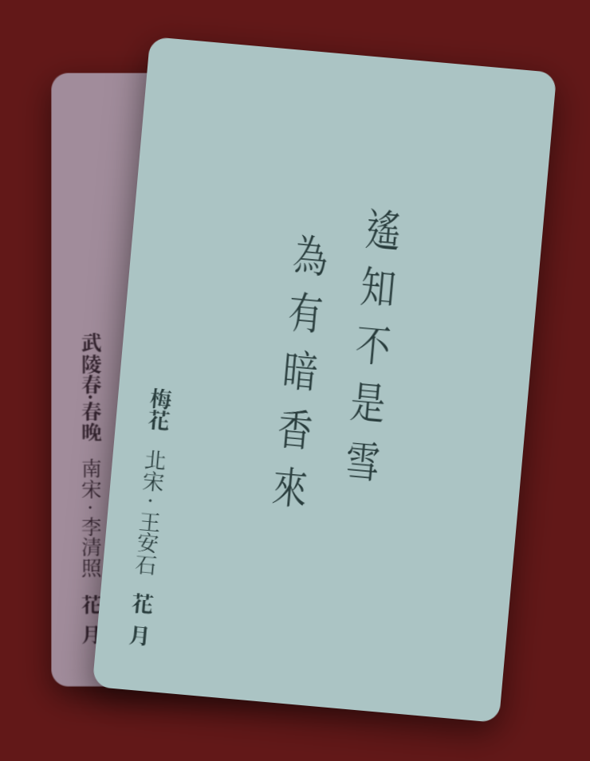 

### 🎮 趣味遊戲模組
我們設計了多款各具特色的遊戲，考驗你的詩詞功力：
1. **慢思快選 (Game 1)**：在壓力與時間的挑戰下，精確選擇正確的詩句。
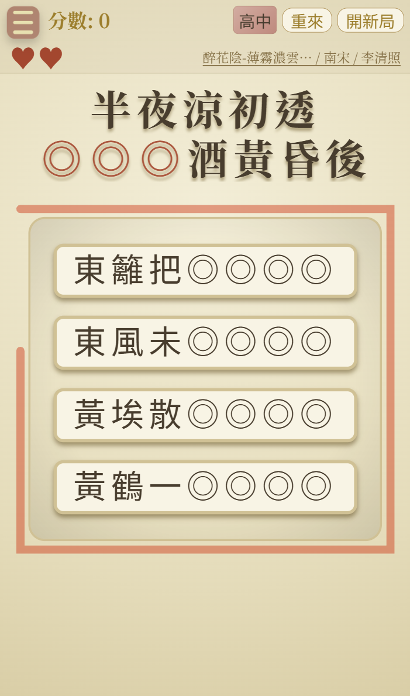 

2. **飛花令 (Game 2)**：經典的傳統遊戲與現代交互結合，測試你對特定關鍵字詩句的掌握度。
 

3. **字爬梯 (Game 3)**：文字與邏輯的考驗，透過拼寫與重組，還原絕美的詩詞篇章。
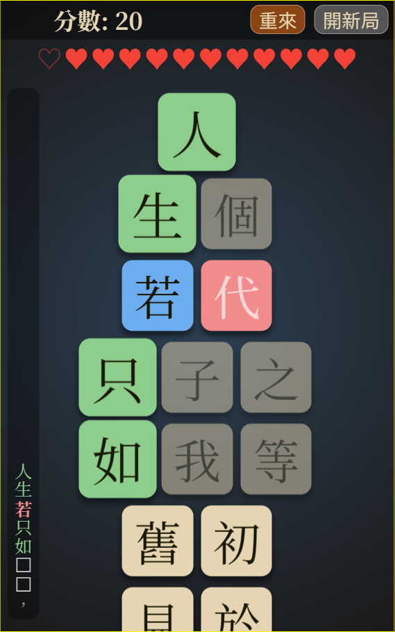 

4. **眾裡尋他千百度 (Game 4)**：在混亂的字群中，憑直覺與實力「尋找」那句動人心弦的詩。
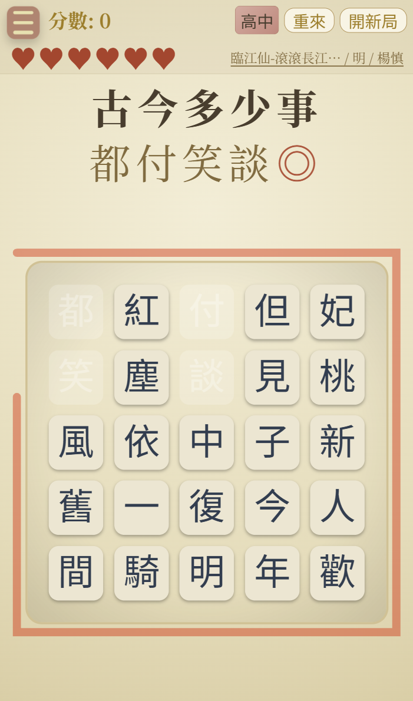 

5. **詩詞小精靈 (Game 5)**：在迷宮中尋找散落的文字，躲避四隻小精靈的追趕，拚湊出記憶中的美好詩句。
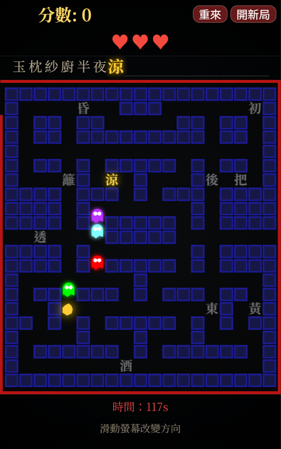 

6. **詩陣侵略 (Game 6)**：擊落入侵的外太空敵人，收復被掠奪的詩句，保護詩詞陣營。
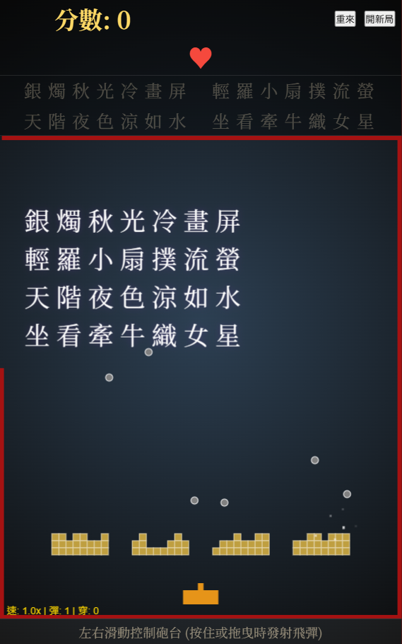 

7. **青鳥雲梯 (Game 7)**：幫助青鳥降落在詩詞方塊上，勇敢地往前飛向浩瀚詩詞白雲。
 

8. **一筆裁詩 (Game 8)**：一筆畫出一句詩，詩詩相連得高分。
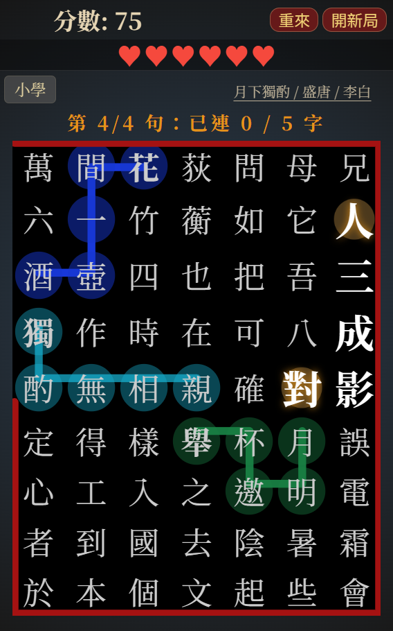 

9. **詩韻鎖扣 (Game 9)**：將混亂擺放的詩句螺帽，依照詩句的順序排列擺回螺絲栓，讓詩句重新合而為一。
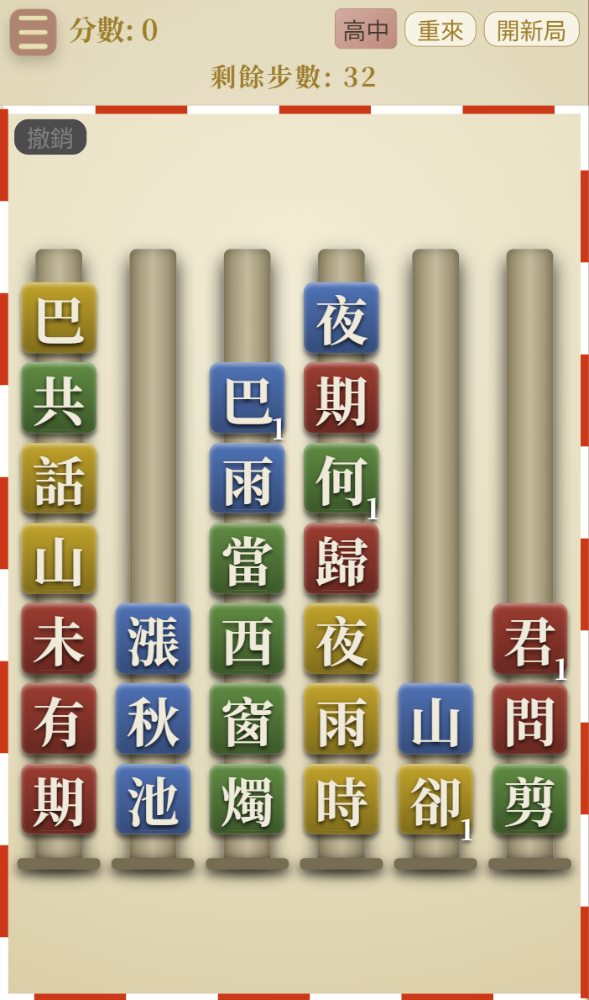 

10. **擊石鳴詩 (Game 10)**：敲磚塊，擊落入侵的外太空敵人，解開被隱藏的詩句。
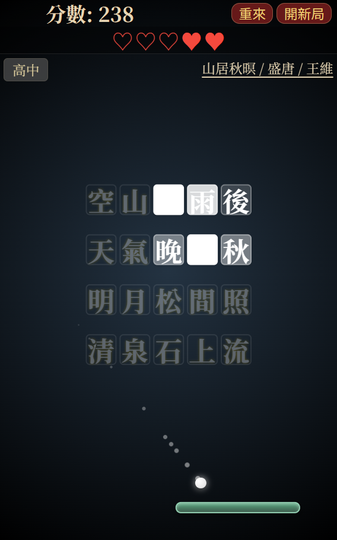 

11. **翻墨識蹤 (Game 11)**：考驗記憶力，翻開被覆蓋的詩句，找出正確擺放位置，一字一字拼湊出完整詩句。
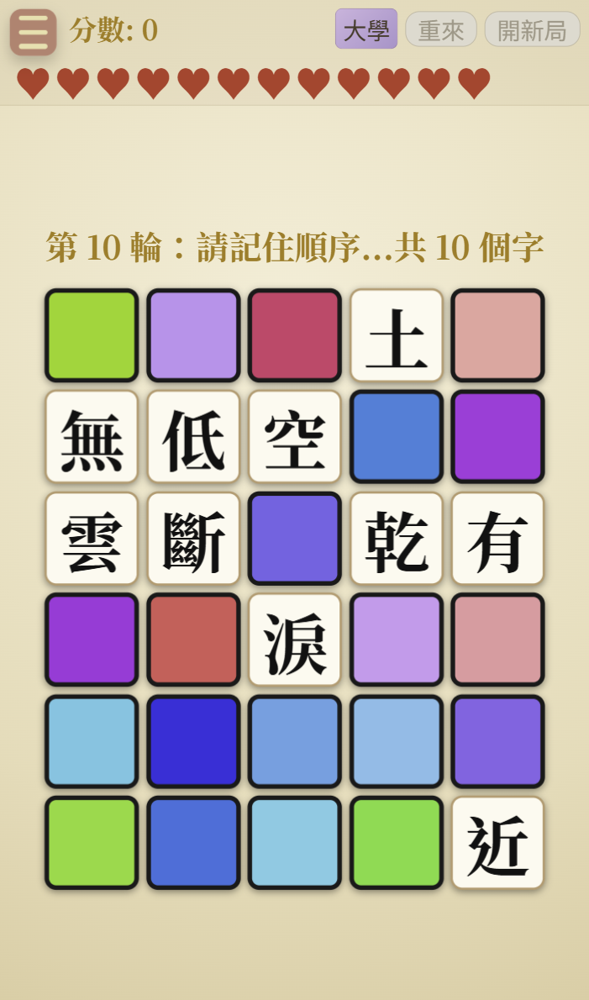 

12. **疏影橫斜 (Game 12)**：同時考驗詩詞能力與記憶力，除了熟記詩句，還需依序翻開被覆蓋的詩句，高溫融化感性與理性，一起燃燒大腦。

 

### 📜 名人列傳與詩詞資料集
- **名人列傳**：深入介紹唐宋名家（如李白、蘇軾、李清照等）的生平事蹟與軼事。
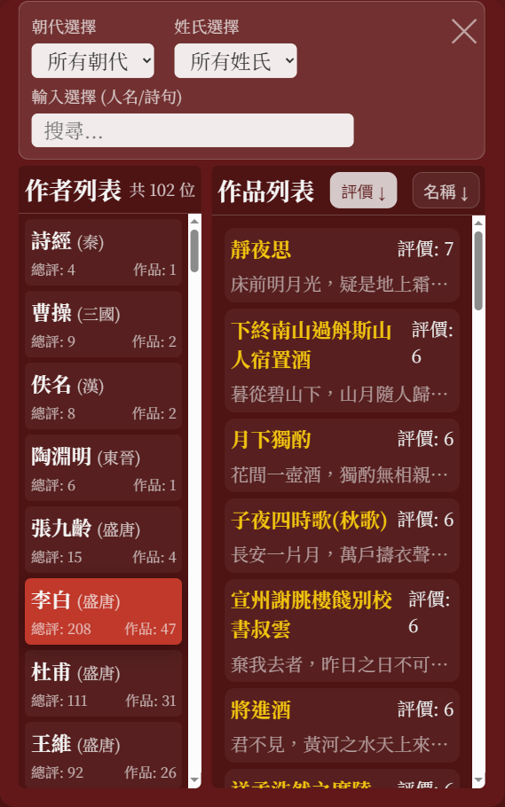 

- **詩詞資料集**：完整的詩詞資料庫，支持隨機與難度篩選，是你的私人朗誦廳。
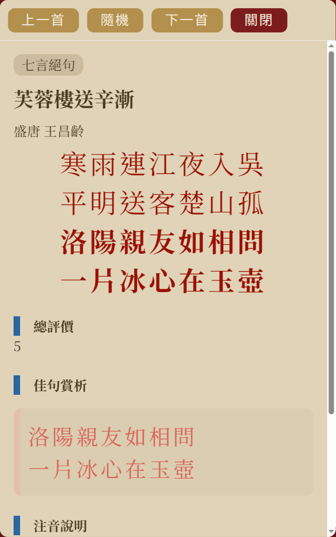 

### 🏆 成就與紀錄系統
- **成長見證**：透過記錄遊戲得分與完成度，玩家可以解鎖各種優美的成就獎牌。
- **進度追蹤**：保存最佳成績，激勵使用者挑戰自我，提升詩詞造詣。
 
 

### 難度選擇
- **挑選適合的難度，從小學、中學、高中、大學直到研究所等級**：
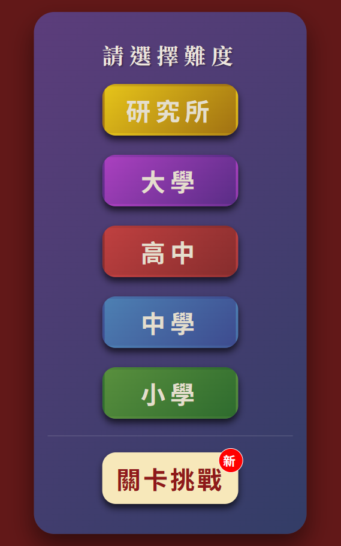 

- **關卡挑戰**：每個遊戲皆有300關不同難度的關卡等著你來挑戰。
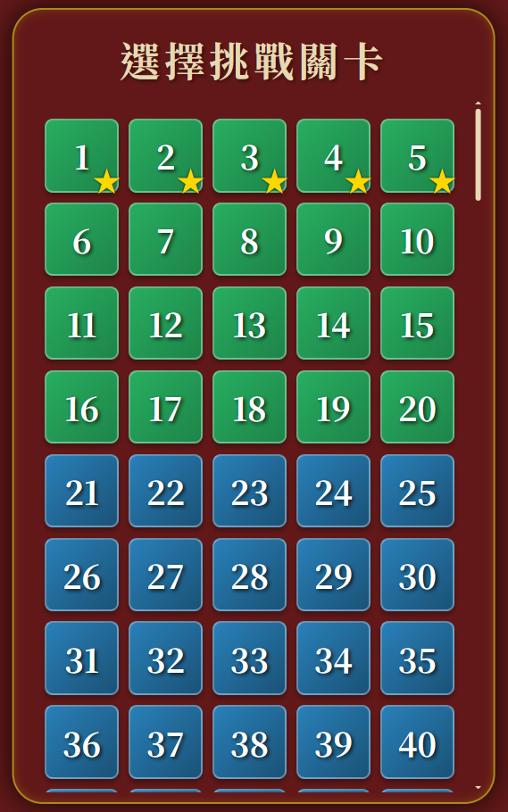 

### 自動截圖功能
- **自動截圖**：自動截圖功能，按下ALT+C可根據"auto_screenshot.txt"的描述來自動截取日曆畫面，方便玩家製作日曆書籤。
**使用說明**：
1. 按下ALT+C，先手動選取auto_screenshot.txt檔案。
2. 螢幕會顯示「分享分頁」視窗，請選擇「此分頁 (This Tab)」並按分享。
3. 選擇圖片儲存目錄。
4. 程式會連動日曆並自動擷取最真實的畫面（支援所有CSS特效與漸層顏色）。

### 觸發領獎過程，方便測試
- **觸發領獎過程**：按下ALT+W可觸發領獎過程，方便測試領獎動畫與獎牌。
---

## GITHUB 主要更新歷程

| 版本 | 日期 | 更新亮點 |
| :--- | :--- | :--- |
| **V0.16.1.0** | 2026-04-24 | 整理與修改宣傳簡報資料 |
| **V0.16.0.0** | 2026-04-14 | 新增正式版人事時地與步步驚心、遊戲統計分析圖表的玩家排名，調整漢堡選單位置，降低慢思快選分數，修正青鳥雲梯研究所找不到適合詩詞題目。|
| **V0.15.1.0** | 2026-04-10 | 新增未測試的game13人事時地與game14步步驚心。|
| **V0.15.0.0** | 2026-04-09 | 新增supabase網路同步玩家資料與統計分析後臺網頁、玩家暱稱功能。修正即時獎勵彈窗無法領取。詳見《花月》網頁遊戲：雲端存檔功能實作手冊.md|
| **V0.14.12.0** | 2026-04-08 | 取消gamewin()一律使用gameOver()避免積分錯誤，增加至8首曲子並修正音階錯誤，修正字爬梯速度。|
| **V0.14.11.0** | 2026-04-07 | 新增共用遊戲規則說明彈窗、鋼琴七音階、四首曲子。|
| **V0.14.10.0** | 2026-04-02 | 修正詩詞資料集與作者生平的捲動體驗。感謝文鼎哥來函指正|
| **V0.14.9.0** | 2026-04-02 | 新增以節氣節日優先挑選適當詩詞的功能refresh_assignments.py，修正日曆農曆資料過長顯示錯誤。|
| **V0.14.8.0** | 2026-04-01 | 修正introCard.js的更新日期。|
| **V0.14.7.0** | 2026-04-01 | 新增共用的結算彈窗gameMessage.js，並將各遊戲的結算邏輯移至該檔案，優化Converter.html注音欄位自動轉換功能。|
| **V0.14.6.0** | 2026-03-30 | 新增獨立的作者生平資料庫檔案 author_biography.js。詩詞資料頁面新增「複製詩文」及「個別區塊複製」功能，並加入全版面的「放大鏡詩詞搜尋」功能。成就面板新增 Alt+W 熱鍵以供快速測試動態特效，新增六首詩詞，提高擊石鳴詩的反彈棒高度，並凸顯變寬特效。|
| **V0.14.5.0** | 2026-03-27 | 優化眾裡尋他千百度高中難度。|
| **V0.14.4.0** | 2026-03-27 | 增加眾裡尋他千百度大學與研究所難度的遊戲規則，非單字反應，必須輸入一整句再做判斷，調整飛花令時間長度。|
| **V0.14.3.0** | 2026-03-27 | 修正漢堡選單造成只剩紅底，優化introCard自動淡出、GAME1難度調整。|
| **V0.14.2.0** | 2026-03-27 | 修正一筆裁詩判斷至少一句是正確的、詩陣侵略物件移動速度在PC與手機的差異。|
| **V0.14.1.0** | 2026-03-26 | 修正字爬梯使用混淆字出現英文字的錯誤。|
| **V0.14.0.0** | 2026-03-26 | 新增關卡挑戰模式、遊戲中即時成就獎勵，優化音效高低音量與回響、成就殿堂得分獎勵、翻墨識蹤翻牌速度。|
| **V0.13.4.0** | 2026-03-24 | 統一遊戲難度參數命名，修改遊戲類型介面設計規範.md。|
| **V0.13.3.0** | 2026-03-20 | 修正翻墨識蹤高中難度會跳過最後一輪。|
| **V0.13.2.0** | 2026-03-19 | 修正擊石鳴詩反彈條在PC跟手機的差異。統一head跟sub-head的高度與顏色，添加遊戲類型介面設計規範.md內容。新增點亮古典文學：使用 AI 輔助開發《花月》唐詩宋詞遊戲經驗分享.md、各遊戲的企畫書與遊戲心得.md供宣傳使用、12個遊戲總結建議.md。|
| **V0.13.1.0** | 2026-03-18 | 新增遊戲中選擇難度功能，優化漢堡選單寬度、青鳥雲梯提高難度、擊石鳴詩字數與降低難度、疏影橫斜降低難度。|
| **V0.13.0.0** | 2026-03-17 | 新增疏影橫斜、自動截圖功能，優化漢堡選單圖片功能、日曆佈局。|
| **V0.12.0.0** | 2026-03-13 | 修正得分小數點，新增擊石鳴詩、翻墨識蹤。|
| **V0.11.4.0** | 2026-03-12 | 修正日曆第一行往上移動錯誤、慢思快選重複答案、詩韻鎖扣成功特效，優化詩陣侵略得分。|
| **V0.11.3.0** | 2026-03-11 | 修正青鳥雲梯無法通過錯誤、詩陣侵略穿透彈，優化一筆裁詩混淆字，添加三首詩詞。|
| **V0.11.2.0** | 2026-03-10 | 全頁面添加音效，新增常用詩詞字頻率統計，優化詩詞題目、混淆字、音效等共用功能。優化詩陣侵略介面尺寸、一筆裁詩路徑、詩韻鎖扣勝負判斷。|
| **V0.11.1.0** | 2026-03-06 | 新增產生詩詞題目的共用功能，優化青鳥雲梯、一筆裁詩、詩韻鎖扣介面。|
| **V0.11.0.0** | 2026-03-05 | 新增(僅功能)青鳥雲梯、一筆裁詩、詩韻鎖扣。|
| **V0.10.0.0** | 2026-03-03 | 新增"詩詞小精靈"、"詩陣侵略"。優化關於花月、成就與紀錄、名人列傳、詩詞資料集介面。 |
| **V0.9.0.0** | 2026-02-26 | 新增"關於花月"、"成就與紀錄"，優化名人列傳、詩詞資料集介面。 |
| **V0.8.1.0** | 2026-02-24 | 新增日曆預先製作列表、修正農曆與節日標記，平衡積分系統並優化名人列傳排版。 |
| **V0.8.0.0** | 2026-02-12 | 重大優化轉換工具，提供注音同音字與大陸拼音支持，擴充語料庫。 |
| **V0.7.0.0** | 2026-01-13 | 優化資料集介面，調整遊戲難度梯度（降低時間壓力），優化字體顯示。 |
| **V0.6.0.0** | 2026-01-12 | 程式碼架構優化，統一 CSS 規範與水墨宣紙渲染風格。 |
| **V0.5.0.0** | 2026-01-09 | 新增遊戲《眾裡尋他千百度》、名人列傳模組，優化電腦端解析度適應。 |
| **V0.4.0.0** | 2026-01-06 | 整理 360 首經典詩詞，將難度重構為七階體系，優化難度選擇菜單。 |
| **V0.3.0.0** | 2025-12-26 | 簡化與統一全域 CSS 結構，整體介面達到高度視覺一致性。 |
| **V0.2.0.0** | 2025-12-23 | 統一遊戲介面架構，導入獨立漢堡選單與全螢幕功能，大幅提升手機適配度。 |
| **V0.1.1.0** | 2025-12-19 | 完成日曆、卡片、飛花令、字爬梯等基礎功能開發與上線測試。 |
| **V0.1.0.0** | 2025-12-16 | **發布網頁初版**：專案「花月」網頁版正式誕生，建立基本架構。 |

---

## 🛠️ 開發與輔助工具(詳見'tools/詩詞資料更新說明書.md')
為了維護龐大的詩詞資料庫，我們開發了幾項輔助工具（位於 `tools/` 與根目錄）：
- **詩詞文字資料轉換器 (`tools/converter.html`)**：將EXCEL格式轉換為標準的 JSON 資料格式。
- **日曆分配腳本 (`tools/refresh_assignments.py`與`tools/refresh_assignments.bat`)**：自動生成每日詩詞分配，確保日曆內容的多樣性與時令性。可直接執行`tools/三年份的日曆詩詞資料_refresh_assignments.bat`產生三年份的日曆詩詞資料。
- **(已取消)詩詞自動標註工具 (`tools/enricher.html`)**：自動分析詩詞內容並匹配標籤（Tags）與宜/忌資訊。

## 發布至GitHub Pages
- **詳見'tools/發布至GitHub Pages.md'** 只需要跟著流程做一次，後續更新依照git commit與git push方式即可。

## 技術棧
- **Frontend**: Vanilla HTML5, CSS3, JavaScript (ES6+).
- **Styling**: 中式水墨宣紙渲染風格。
- **Library**: [lunar-javascript](https://github.com/6tail/lunar-javascript) (農曆轉換).
- **Architecture**: 響應式設計 (Responsive Design)，完美支援移動端與桌面端。

## 如何運行
1. 複製此倉庫到本地。
2. 使用任何本地伺服器（如 VS Code 的 Live Server）開啟 `index.html`。
3. 或是直接在瀏覽器中開啟 `index.html` 即可開始體驗。

---

---

希望透過這款遊戲，能讓更多人愛上中國詩詞，一起品味那跨越千年的文學芬芳。🌹🏮
